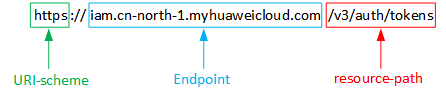

# 构造请求<a name="mrs_02_0008"></a>

本节介绍REST API请求的组成，并以调用IAM服务的[获取用户Token](https://support.huaweicloud.com/api-iam/iam_30_0001.html)说明如何调用API，该API获取用户的Token，Token可以用于调用其他API时鉴权。

您还可以通过这个视频教程了解如何构造请求调用API：[https://bbs.huaweicloud.com/videos/102987](https://bbs.huaweicloud.com/videos/102987)  。

## 请求URI<a name="s9eedb9a4a4604ace8e0eccf8501b1cf7"></a>

请求URI由如下部分组成：

**\{URI-scheme\}://\{Endpoint\}/\{resource-path\}?\{query-string\}**

尽管请求URI包含在请求消息头中，但大多数语言或框架都要求您从请求消息中单独传递它，所以在此单独强调。

**表 1**  URI中的参数说明

<a name="table1637277135646"></a>
<table><thead align="left"><tr id="row42856273135646"><th class="cellrowborder" valign="top" width="20%" id="mcps1.2.3.1.1"><p id="p48806094135646"><a name="p48806094135646"></a><a name="p48806094135646"></a>参数</p>
</th>
<th class="cellrowborder" valign="top" width="80%" id="mcps1.2.3.1.2"><p id="p60979560135646"><a name="p60979560135646"></a><a name="p60979560135646"></a>说明</p>
</th>
</tr>
</thead>
<tbody><tr id="row50093829135713"><td class="cellrowborder" valign="top" width="20%" headers="mcps1.2.3.1.1 "><p id="p13294067135723"><a name="p13294067135723"></a><a name="p13294067135723"></a>URI-scheme</p>
</td>
<td class="cellrowborder" valign="top" width="80%" headers="mcps1.2.3.1.2 "><p id="p188391318133718"><a name="p188391318133718"></a><a name="p188391318133718"></a>表示用于传输请求的协议，当前所有API均采用<strong id="b083917185374"><a name="b083917185374"></a><a name="b083917185374"></a>HTTPS</strong>协议。</p>
</td>
</tr>
<tr id="row40397318135646"><td class="cellrowborder" valign="top" width="20%" headers="mcps1.2.3.1.1 "><p id="p50957329135646"><a name="p50957329135646"></a><a name="p50957329135646"></a>Endpoint</p>
</td>
<td class="cellrowborder" valign="top" width="80%" headers="mcps1.2.3.1.2 "><p id="p33902960135646"><a name="p33902960135646"></a><a name="p33902960135646"></a>指定承载REST服务端点的服务器域名或IP，不同服务不同区域的Endpoint不同，您可以从<a href="https://developer.huaweicloud.com/endpoint?MRS" target="_blank" rel="noopener noreferrer">终端节点及区域</a>获取。</p>
</td>
</tr>
<tr id="row1377075135915"><td class="cellrowborder" valign="top" width="20%" headers="mcps1.2.3.1.1 "><p id="p44434271135915"><a name="p44434271135915"></a><a name="p44434271135915"></a>resource-path</p>
</td>
<td class="cellrowborder" valign="top" width="80%" headers="mcps1.2.3.1.2 "><p id="p42406232135915"><a name="p42406232135915"></a><a name="p42406232135915"></a>资源路径，也即API访问路径。从具体接口的URI模块获取，例如<a href="https://support.huaweicloud.com/api-iam/iam_30_0001.html" target="_blank" rel="noopener noreferrer">获取用户Token</a>API的resource-path为<span class="parmvalue" id="parmvalue19213174111414"><a name="parmvalue19213174111414"></a><a name="parmvalue19213174111414"></a>“/v3/auth/tokens”</span>。</p>
</td>
</tr>
<tr id="row11383469135646"><td class="cellrowborder" valign="top" width="20%" headers="mcps1.2.3.1.1 "><p id="p62949675135953"><a name="p62949675135953"></a><a name="p62949675135953"></a>query-string</p>
</td>
<td class="cellrowborder" valign="top" width="80%" headers="mcps1.2.3.1.2 "><p id="p29437205428"><a name="p29437205428"></a><a name="p29437205428"></a>查询参数，是可选部分，并不是每个API都有查询参数。查询参数前面需要带一个<span class="parmname" id="parmname10944172014217"><a name="parmname10944172014217"></a><a name="parmname10944172014217"></a>“？”</span>，形式为<span class="parmname" id="parmname3944142064215"><a name="parmname3944142064215"></a><a name="parmname3944142064215"></a>“参数名=参数取值”</span>，例如<span class="parmname" id="parmname7944142024210"><a name="parmname7944142024210"></a><a name="parmname7944142024210"></a>“limit=10”</span>，表示查询不超过10条数据。</p>
</td>
</tr>
</tbody>
</table>

例如您需要获取IAM在“华北-北京一“区域的Token，则需使用“华北-北京一“区域的Endpoint（iam.cn-north-1.myhuaweicloud.com），并在[获取用户Token](https://support.huaweicloud.com/api-iam/iam_30_0001.html)的URI部分找到resource-path（/v3/auth/tokens），拼接起来如下所示。

```
https://iam.cn-north-1.myhuaweicloud.com/v3/auth/tokens
```

**图 1**  URI示意图<a name="f5af5b805be5e4789ac38554a1f5ba359"></a>  


> **说明：** 
>为查看方便，在每个具体API的URI部分，只给出resource-path部分，并将请求方法写在一起。这是因为URI-scheme都是HTTPS，而Endpoint在同一个区域也相同，所以简洁起见将这两部分省略。

## 请求方法<a name="sbed10754c8dc4487bfa0ca87d7021ff4"></a>

HTTP请求方法（也称为操作或动词），它告诉服务你正在请求什么类型的操作。

**表 2**  HTTP方法

<a name="te2859e52b4e24000b2f59d49fc62d961"></a>
<table><thead align="left"><tr id="r1d6021d59aaf4acb81ea241def92f939"><th class="cellrowborder" valign="top" width="30%" id="mcps1.2.3.1.1"><p id="ae8c19459722f406e8e6295de2bb2f9a0"><a name="ae8c19459722f406e8e6295de2bb2f9a0"></a><a name="ae8c19459722f406e8e6295de2bb2f9a0"></a><strong id="a7c85b0370cd14257961f56ba5a2c04d3"><a name="a7c85b0370cd14257961f56ba5a2c04d3"></a><a name="a7c85b0370cd14257961f56ba5a2c04d3"></a>方法</strong></p>
</th>
<th class="cellrowborder" valign="top" width="70%" id="mcps1.2.3.1.2"><p id="ab3ad94284cf84ce2ac03c4b698aca8f0"><a name="ab3ad94284cf84ce2ac03c4b698aca8f0"></a><a name="ab3ad94284cf84ce2ac03c4b698aca8f0"></a><strong id="a163295fba9c64e9da3e59c942a5d0d0d"><a name="a163295fba9c64e9da3e59c942a5d0d0d"></a><a name="a163295fba9c64e9da3e59c942a5d0d0d"></a>说明</strong></p>
</th>
</tr>
</thead>
<tbody><tr id="r89e6aa7f8e5344cd9e86d133a3a28ef1"><td class="cellrowborder" valign="top" width="30%" headers="mcps1.2.3.1.1 "><p id="a3c8f8931c476472d9d96faaadeb0ede7"><a name="a3c8f8931c476472d9d96faaadeb0ede7"></a><a name="a3c8f8931c476472d9d96faaadeb0ede7"></a>GET</p>
</td>
<td class="cellrowborder" valign="top" width="70%" headers="mcps1.2.3.1.2 "><p id="a4abb77b53efe49df8e8d6d9f168794cc"><a name="a4abb77b53efe49df8e8d6d9f168794cc"></a><a name="a4abb77b53efe49df8e8d6d9f168794cc"></a>请求服务器返回指定资源。</p>
</td>
</tr>
<tr id="r5b91f00982dc4b1bb53809b42f852ff8"><td class="cellrowborder" valign="top" width="30%" headers="mcps1.2.3.1.1 "><p id="a8270aaeb38654419a33f753b3cf81f6a"><a name="a8270aaeb38654419a33f753b3cf81f6a"></a><a name="a8270aaeb38654419a33f753b3cf81f6a"></a>PUT</p>
</td>
<td class="cellrowborder" valign="top" width="70%" headers="mcps1.2.3.1.2 "><p id="a162bfdadd0854b93886e40b697230bf1"><a name="a162bfdadd0854b93886e40b697230bf1"></a><a name="a162bfdadd0854b93886e40b697230bf1"></a>请求服务器更新指定资源。</p>
</td>
</tr>
<tr id="r6c52676a3ed74eb9b701eff09979ea98"><td class="cellrowborder" valign="top" width="30%" headers="mcps1.2.3.1.1 "><p id="a1044228945af42b9af786878fecd2b42"><a name="a1044228945af42b9af786878fecd2b42"></a><a name="a1044228945af42b9af786878fecd2b42"></a>POST</p>
</td>
<td class="cellrowborder" valign="top" width="70%" headers="mcps1.2.3.1.2 "><p id="a2ce63255019041ef86271d2d87e7dd93"><a name="a2ce63255019041ef86271d2d87e7dd93"></a><a name="a2ce63255019041ef86271d2d87e7dd93"></a>请求服务器新增资源或执行特殊操作。</p>
</td>
</tr>
<tr id="rc20c4044389947a88826ea831d62e5ff"><td class="cellrowborder" valign="top" width="30%" headers="mcps1.2.3.1.1 "><p id="a1cd818867dcb49c684bd5bf51c094ca2"><a name="a1cd818867dcb49c684bd5bf51c094ca2"></a><a name="a1cd818867dcb49c684bd5bf51c094ca2"></a>DELETE</p>
</td>
<td class="cellrowborder" valign="top" width="70%" headers="mcps1.2.3.1.2 "><p id="a4630897d92d143da8a948947fd1dcee7"><a name="a4630897d92d143da8a948947fd1dcee7"></a><a name="a4630897d92d143da8a948947fd1dcee7"></a>请求服务器删除指定资源，如删除对象等。</p>
</td>
</tr>
<tr id="r5b3aad9da5814d00974c3f8bf89710e4"><td class="cellrowborder" valign="top" width="30%" headers="mcps1.2.3.1.1 "><p id="a86491583901b4bd08f9788aad3c5e819"><a name="a86491583901b4bd08f9788aad3c5e819"></a><a name="a86491583901b4bd08f9788aad3c5e819"></a>HEAD</p>
</td>
<td class="cellrowborder" valign="top" width="70%" headers="mcps1.2.3.1.2 "><p id="a05a43f5b4bd24bc4a63dd4f582787499"><a name="a05a43f5b4bd24bc4a63dd4f582787499"></a><a name="a05a43f5b4bd24bc4a63dd4f582787499"></a>请求服务器资源头部。</p>
</td>
</tr>
<tr id="rf16a7265d769492ca693ec643dc59654"><td class="cellrowborder" valign="top" width="30%" headers="mcps1.2.3.1.1 "><p id="a4e4a78807e9643e6ae9296db665fd1a2"><a name="a4e4a78807e9643e6ae9296db665fd1a2"></a><a name="a4e4a78807e9643e6ae9296db665fd1a2"></a>PATCH</p>
</td>
<td class="cellrowborder" valign="top" width="70%" headers="mcps1.2.3.1.2 "><p id="a257c40723a944e729361e7eb6a4865f6"><a name="a257c40723a944e729361e7eb6a4865f6"></a><a name="a257c40723a944e729361e7eb6a4865f6"></a>请求服务器更新资源的部分内容。</p>
<p id="ac0250cbece57436db812b75a53bb4bae"><a name="ac0250cbece57436db812b75a53bb4bae"></a><a name="ac0250cbece57436db812b75a53bb4bae"></a>当资源不存在的时候，PATCH可能会去创建一个新的资源。</p>
</td>
</tr>
</tbody>
</table>

在[获取用户Token](https://support.huaweicloud.com/api-iam/iam_30_0001.html)的URI部分，您可以看到其请求方法为“POST“，则其请求为：

```
POST https://iam.cn-north-1.myhuaweicloud.com/v3/auth/tokens
```

## 请求消息头<a name="s3917e74cec4f48feaeb43cef9d885bdf"></a>

附加请求头字段，如指定的URI和HTTP方法所要求的字段。例如定义消息体类型的请求头“Content-Type“，请求鉴权信息等。

详细的公共请求消息头字段请参见[表3](#td181b06f1c0949cb913acd8d77f21ec3)。

**表 3**  公共请求消息头

<a name="td181b06f1c0949cb913acd8d77f21ec3"></a>
<table><thead align="left"><tr id="r97d2c57e12614bd3afdc94a4204ed595"><th class="cellrowborder" valign="top" width="20%" id="mcps1.2.5.1.1"><p id="aa019e06442ea43f7a2dd236b9eeb153c"><a name="aa019e06442ea43f7a2dd236b9eeb153c"></a><a name="aa019e06442ea43f7a2dd236b9eeb153c"></a>名称</p>
</th>
<th class="cellrowborder" valign="top" width="30%" id="mcps1.2.5.1.2"><p id="a0b5237510efb47c185142788a435c90a"><a name="a0b5237510efb47c185142788a435c90a"></a><a name="a0b5237510efb47c185142788a435c90a"></a>描述</p>
</th>
<th class="cellrowborder" valign="top" width="20%" id="mcps1.2.5.1.3"><p id="a8df98fec2ab9432c90753890865721a1"><a name="a8df98fec2ab9432c90753890865721a1"></a><a name="a8df98fec2ab9432c90753890865721a1"></a>是否必选</p>
</th>
<th class="cellrowborder" valign="top" width="30%" id="mcps1.2.5.1.4"><p id="zh-cn_topic_0037324703_p865237161145"><a name="zh-cn_topic_0037324703_p865237161145"></a><a name="zh-cn_topic_0037324703_p865237161145"></a>示例</p>
</th>
</tr>
</thead>
<tbody><tr id="r775e22ddde31427cb0c75310d3b275f5"><td class="cellrowborder" valign="top" width="20%" headers="mcps1.2.5.1.1 "><p id="ad5553c8196a14fbcb91cb55152fee53d"><a name="ad5553c8196a14fbcb91cb55152fee53d"></a><a name="ad5553c8196a14fbcb91cb55152fee53d"></a>X-Sdk-Date</p>
</td>
<td class="cellrowborder" valign="top" width="30%" headers="mcps1.2.5.1.2 "><p id="a7cd5e01a2bc34080b44f606c2c248dc7"><a name="a7cd5e01a2bc34080b44f606c2c248dc7"></a><a name="a7cd5e01a2bc34080b44f606c2c248dc7"></a>请求的发生时间，格式为(YYYYMMDD'T'HHMMSS'Z')。</p>
<p id="a5ea5e42d645143bbbae5f9c4ab452d7d"><a name="a5ea5e42d645143bbbae5f9c4ab452d7d"></a><a name="a5ea5e42d645143bbbae5f9c4ab452d7d"></a>取值为当前系统的GMT时间。</p>
</td>
<td class="cellrowborder" valign="top" width="20%" headers="mcps1.2.5.1.3 "><p id="ab64471a82ff44053a057c927cbf9ddc9"><a name="ab64471a82ff44053a057c927cbf9ddc9"></a><a name="ab64471a82ff44053a057c927cbf9ddc9"></a>使用AK/SK认证时必选。</p>
</td>
<td class="cellrowborder" valign="top" width="30%" headers="mcps1.2.5.1.4 "><p id="a3e18fe766b9a4185830a0fe282eb2680"><a name="a3e18fe766b9a4185830a0fe282eb2680"></a><a name="a3e18fe766b9a4185830a0fe282eb2680"></a>20150907T101459Z</p>
</td>
</tr>
<tr id="r982b99c7ac074e80b63e96059bc375ff"><td class="cellrowborder" valign="top" width="20%" headers="mcps1.2.5.1.1 "><p id="a6a9ab4af31ef41978c7cd032050ae14a"><a name="a6a9ab4af31ef41978c7cd032050ae14a"></a><a name="a6a9ab4af31ef41978c7cd032050ae14a"></a>Host</p>
</td>
<td class="cellrowborder" valign="top" width="30%" headers="mcps1.2.5.1.2 "><p id="aaa38a9c8e2dc4fb78234cbb5c1cd580d"><a name="aaa38a9c8e2dc4fb78234cbb5c1cd580d"></a><a name="aaa38a9c8e2dc4fb78234cbb5c1cd580d"></a>请求的服务器信息，从服务API的URL中获取。值为hostname[:port]。端口缺省时使用默认的端口，https的默认端口为443。</p>
</td>
<td class="cellrowborder" valign="top" width="20%" headers="mcps1.2.5.1.3 "><p id="a084e3b07cf104f05944d08ef2a96b1c4"><a name="a084e3b07cf104f05944d08ef2a96b1c4"></a><a name="a084e3b07cf104f05944d08ef2a96b1c4"></a>使用AK/SK认证时必选。</p>
</td>
<td class="cellrowborder" valign="top" width="30%" headers="mcps1.2.5.1.4 "><p id="a8de4dbac3b7a483b9d39efbdf632998a"><a name="a8de4dbac3b7a483b9d39efbdf632998a"></a><a name="a8de4dbac3b7a483b9d39efbdf632998a"></a>code.test.com</p>
<p id="ac8a2d0ee992c40cfa38782c0b85210a9"><a name="ac8a2d0ee992c40cfa38782c0b85210a9"></a><a name="ac8a2d0ee992c40cfa38782c0b85210a9"></a>or</p>
<p id="ab29d121a7fb94fe3822dca91b79fe760"><a name="ab29d121a7fb94fe3822dca91b79fe760"></a><a name="ab29d121a7fb94fe3822dca91b79fe760"></a>code.test.com:443</p>
</td>
</tr>
<tr id="rc7911eda8b784dceb1da661d56877f0c"><td class="cellrowborder" valign="top" width="20%" headers="mcps1.2.5.1.1 "><p id="a5f1759adb3ce437a842cc9af6a3fb071"><a name="a5f1759adb3ce437a842cc9af6a3fb071"></a><a name="a5f1759adb3ce437a842cc9af6a3fb071"></a>Content-Type</p>
</td>
<td class="cellrowborder" valign="top" width="30%" headers="mcps1.2.5.1.2 "><p id="p632810083617"><a name="p632810083617"></a><a name="p632810083617"></a>发送的实体的MIME类型。推荐用户默认使用application/json，有其他取值时会在具体接口中专门说明。</p>
</td>
<td class="cellrowborder" valign="top" width="20%" headers="mcps1.2.5.1.3 "><p id="a2ca751e0d5904460aae7f6d5f5dc3334"><a name="a2ca751e0d5904460aae7f6d5f5dc3334"></a><a name="a2ca751e0d5904460aae7f6d5f5dc3334"></a>是</p>
</td>
<td class="cellrowborder" valign="top" width="30%" headers="mcps1.2.5.1.4 "><p id="a17e3634848fc49ae9ea11717665e49ea"><a name="a17e3634848fc49ae9ea11717665e49ea"></a><a name="a17e3634848fc49ae9ea11717665e49ea"></a>application/json</p>
</td>
</tr>
<tr id="r38eb00e3fde947918d9a8cf46c11b74f"><td class="cellrowborder" valign="top" width="20%" headers="mcps1.2.5.1.1 "><p id="aa2ffb672489a4ff4b2b47b0ee711625e"><a name="aa2ffb672489a4ff4b2b47b0ee711625e"></a><a name="aa2ffb672489a4ff4b2b47b0ee711625e"></a>Content-Length</p>
</td>
<td class="cellrowborder" valign="top" width="30%" headers="mcps1.2.5.1.2 "><p id="a67d79ec8bb3d412fb1f2d59a3767248a"><a name="a67d79ec8bb3d412fb1f2d59a3767248a"></a><a name="a67d79ec8bb3d412fb1f2d59a3767248a"></a>请求body长度，单位为Byte。</p>
</td>
<td class="cellrowborder" valign="top" width="20%" headers="mcps1.2.5.1.3 "><p id="a9815cc0accf94167b7f3607db7b90880"><a name="a9815cc0accf94167b7f3607db7b90880"></a><a name="a9815cc0accf94167b7f3607db7b90880"></a>POST/PUT请求必填。 GET不能包含。</p>
</td>
<td class="cellrowborder" valign="top" width="30%" headers="mcps1.2.5.1.4 "><p id="af6f5766e2ad548dcb9e40b3a0074c125"><a name="af6f5766e2ad548dcb9e40b3a0074c125"></a><a name="af6f5766e2ad548dcb9e40b3a0074c125"></a>3495</p>
</td>
</tr>
<tr id="r47347abb1c994c38bacebe25ec1d218e"><td class="cellrowborder" valign="top" width="20%" headers="mcps1.2.5.1.1 "><p id="ab8ee25b819d94be08bf7cabf1d921b9a"><a name="ab8ee25b819d94be08bf7cabf1d921b9a"></a><a name="ab8ee25b819d94be08bf7cabf1d921b9a"></a>X-Project-Id</p>
</td>
<td class="cellrowborder" valign="top" width="30%" headers="mcps1.2.5.1.2 "><p id="af63b53a9158e418c9317dd79ddcac3db"><a name="af63b53a9158e418c9317dd79ddcac3db"></a><a name="af63b53a9158e418c9317dd79ddcac3db"></a>project id，用于不同project取token。</p>
</td>
<td class="cellrowborder" valign="top" width="20%" headers="mcps1.2.5.1.3 "><p id="a234f4a7f440b4413b1aa19c9462695ab"><a name="a234f4a7f440b4413b1aa19c9462695ab"></a><a name="a234f4a7f440b4413b1aa19c9462695ab"></a>否</p>
</td>
<td class="cellrowborder" valign="top" width="30%" headers="mcps1.2.5.1.4 "><p id="a148d7ff92e5e49cfbb4ac0238cd2ebd4"><a name="a148d7ff92e5e49cfbb4ac0238cd2ebd4"></a><a name="a148d7ff92e5e49cfbb4ac0238cd2ebd4"></a>e9993fc787d94b6c886cbaa340f9c0f4</p>
</td>
</tr>
<tr id="rbec1d01d1f9b4bcb8a183ded144e2f0a"><td class="cellrowborder" valign="top" width="20%" headers="mcps1.2.5.1.1 "><p id="a5ad0cfc3781243c9ac6fd8e5c47b8894"><a name="a5ad0cfc3781243c9ac6fd8e5c47b8894"></a><a name="a5ad0cfc3781243c9ac6fd8e5c47b8894"></a>X-Auth-Token</p>
</td>
<td class="cellrowborder" valign="top" width="30%" headers="mcps1.2.5.1.2 "><p id="a399eb5e20970416186d95d614e84af10"><a name="a399eb5e20970416186d95d614e84af10"></a><a name="a399eb5e20970416186d95d614e84af10"></a>用户Token。</p>
<p id="p1499864363419"><a name="p1499864363419"></a><a name="p1499864363419"></a>用户Token也就是调用<a href="https://support.huaweicloud.com/api-iam/iam_30_0001.html" target="_blank" rel="noopener noreferrer">获取用户Token</a>接口的响应值，该接口是唯一不需要认证的接口。</p>
<p id="p18998543163416"><a name="p18998543163416"></a><a name="p18998543163416"></a>请求响应成功后在响应消息头中包含的“X-Subject-Token”的值即为Token值。</p>
</td>
<td class="cellrowborder" valign="top" width="20%" headers="mcps1.2.5.1.3 "><p id="a8ef6da5c4a3742a0b50adb96d3a52baf"><a name="a8ef6da5c4a3742a0b50adb96d3a52baf"></a><a name="a8ef6da5c4a3742a0b50adb96d3a52baf"></a>否</p>
<p id="a90d30c52a285436c8efb6b0924bc3912"><a name="a90d30c52a285436c8efb6b0924bc3912"></a><a name="a90d30c52a285436c8efb6b0924bc3912"></a>使用Token认证时必选。</p>
</td>
<td class="cellrowborder" valign="top" width="30%" headers="mcps1.2.5.1.4 "><p id="ac1a9d7862596407ba9dc5ca0dfa508c8"><a name="ac1a9d7862596407ba9dc5ca0dfa508c8"></a><a name="ac1a9d7862596407ba9dc5ca0dfa508c8"></a>-</p>
</td>
</tr>
<tr id="row16125640113240"><td class="cellrowborder" valign="top" width="20%" headers="mcps1.2.5.1.1 "><p id="p31108482113240"><a name="p31108482113240"></a><a name="p31108482113240"></a>X-Language</p>
</td>
<td class="cellrowborder" valign="top" width="30%" headers="mcps1.2.5.1.2 "><p id="p36759104113240"><a name="p36759104113240"></a><a name="p36759104113240"></a>请求语言，支持配置如下值：</p>
<a name="ul5220882114910"></a><a name="ul5220882114910"></a><ul id="ul5220882114910"><li>zh-cn：中文</li><li>en-us：英文</li></ul>
</td>
<td class="cellrowborder" valign="top" width="20%" headers="mcps1.2.5.1.3 "><p id="p24697451113240"><a name="p24697451113240"></a><a name="p24697451113240"></a>否</p>
</td>
<td class="cellrowborder" valign="top" width="30%" headers="mcps1.2.5.1.4 "><p id="p54336490113240"><a name="p54336490113240"></a><a name="p54336490113240"></a>en-us</p>
</td>
</tr>
<tr id="row1305912154611"><td class="cellrowborder" valign="top" width="20%" headers="mcps1.2.5.1.1 "><p id="p59561232104612"><a name="p59561232104612"></a><a name="p59561232104612"></a>X-Domain-Id</p>
</td>
<td class="cellrowborder" valign="top" width="30%" headers="mcps1.2.5.1.2 "><p id="p33051712144616"><a name="p33051712144616"></a><a name="p33051712144616"></a>账号ID。</p>
</td>
<td class="cellrowborder" valign="top" width="20%" headers="mcps1.2.5.1.3 "><p id="p2305312124612"><a name="p2305312124612"></a><a name="p2305312124612"></a>否</p>
</td>
<td class="cellrowborder" valign="top" width="30%" headers="mcps1.2.5.1.4 "><p id="p193051912134613"><a name="p193051912134613"></a><a name="p193051912134613"></a>-</p>
</td>
</tr>
</tbody>
</table>

> **说明：** 
>API同时支持使用AK/SK认证，AK/SK认证是使用SDK对请求进行签名，签名过程会自动往请求中添加Authorization（签名认证信息）和X-Sdk-Date（请求发送的时间）请求头。
>AK/SK认证的详细说明请参见[认证鉴权](认证鉴权.md)的“AK/SK认证”。

对于[获取用户Token](https://support.huaweicloud.com/api-iam/iam_30_0001.html)接口，由于不需要认证，所以只添加“Content-Type“即可，添加消息头后的请求如下所示。

```
POST https://iam.cn-north-1.myhuaweicloud.com/v3/auth/tokens
Content-Type: application/json
```

## 请求消息体（可选）<a name="s5069206352cf46cc84cef8362fdeedd5"></a>

该部分可选。请求消息体通常以结构化格式（如JSON或XML）发出，与请求消息头中Content-Type对应，传递除请求消息头之外的内容。若请求消息体中的参数支持中文，则中文字符必须为UTF-8编码。

每个接口的请求消息体内容不同，也并不是每个接口都需要有请求消息体（或者说消息体为空），GET、DELETE操作类型的接口就不需要消息体，消息体具体内容需要根据具体接口而定。

对于[获取用户Token](https://support.huaweicloud.com/api-iam/iam_30_0001.html)接口，您可以从接口的请求部分看到所需的请求参数及参数说明。将消息体加入后的请求如下所示，加粗的斜体字段需要根据实际值填写，其中_**username**_为用户名，_**domainname**_为用户所属的账号名称，**_\*\*\*\*\*\*\*\*_**为用户登录密码，**_xxxxxxxxxxxxxxxxxx_**为project的ID，获取方法请参见[获取项目ID](获取项目ID.md)。

> **说明：** 
>scope参数定义了Token的作用域，上面示例中获取的Token仅能访问project下的资源。您还可以设置Token的作用域为某个账号下所有资源或账号的某个project下的资源，详细定义请参见IAM服务的[获取用户Token](https://support.huaweicloud.com/api-iam/iam_30_0001.html)。

```
POST https://iam.cn-north-1.myhuaweicloud.com/v3/auth/tokens
Content-Type: application/json

{
    "auth": {
        "identity": {
            "methods": [
                "password"
            ],
            "password": {
                "user": {
                    "name": "username",
                    "password": "********",
                    "domain": {
                        "name": "domainname"
                    }
                }
            }
        },
        "scope": {
            "project": {
                "id": "xxxxxxxxxxxxxxxxxx"
            }
        }
    }
}
```

到这里为止这个请求需要的内容就具备齐全了，您可以使用[curl](https://curl.haxx.se/)、[Postman](https://www.getpostman.com/)或直接编写代码等方式发送请求调用API。对于获取用户Token接口，返回的响应消息头中“x-subject-token”就是需要获取的用户Token。有了Token之后，您就可以使用Token认证调用其他API。

