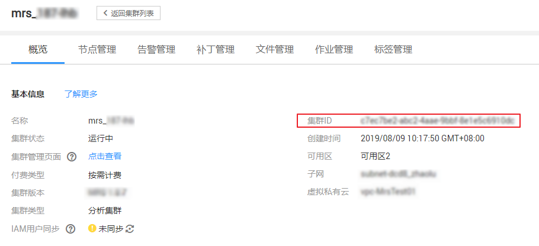

# 获取MRS集群信息

## 获取集群ID

在调用作业相关接口的时候，部分URL中需要填入集群ID（cluster\_id），所以需要先在管理控制台上获取到集群ID。集群ID获取步骤如下：

1.  登录MRS管理控制台。
2.  选择“集群列表 \> 现有集群”，单击待操作集群的集群名称，进入集群详情页面。
3.  选择“概览”页签，在基本信息区域获取“集群ID”。

    **图 1**  集群ID  
    

## 获取作业ID

在调用作业相关接口的时候，部分URL中需要填入作业ID（job\_execution\_id），所以需要先在管理控制台上获取到作业ID。作业ID获取步骤如下：

1.  登录MRS管理控制台。
2.  选择“集群列表 \> 现有集群”，单击待操作集群的集群名称，进入集群详情页面。
3.  选择“作业管理”页签，在作业列表中获取待操作作业对应的“ID”。

    **图 2**  作业ID  
    

