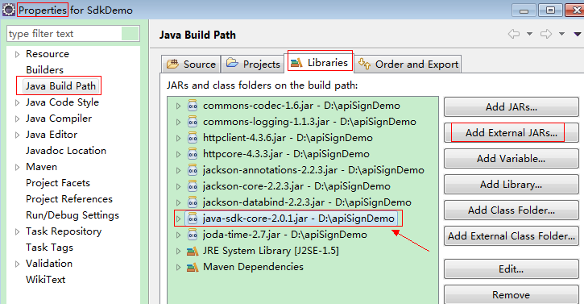
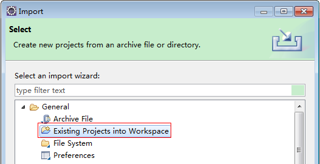
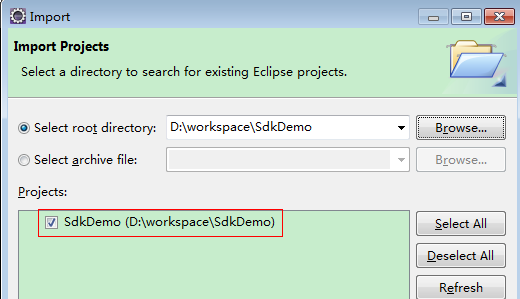
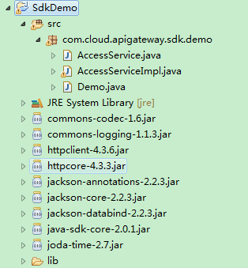

# 获取请求认证<a name="ZH-CN_TOPIC_0109962598"></a>

调用接口有如下两种认证方式，您可以任选其中一种进行认证鉴权。

-   Token认证：通过Token认证调用请求。
-   AK/SK认证：通过AK\(Access Key ID\)/SK\(Secret Access Key\)加密调用请求。推荐使用AK/SK认证，其安全性比Token认证要高。

## Token认证<a name="section856015471403"></a>

当您使用Token认证方式完成认证鉴权时，需要获取用户Token并在调用接口时增加“X-Auth-Token”到业务接口请求消息头中。

1.  发送“POST https://_**IAM的Endpoint**_/v3/auth/tokens”，获取IAM的Endpoint及消息体中的区域名称，请参见[终端节点及区域说明](https://developer.huaweicloud.com/endpoint?MRS)。

    请求内容示例如下：

    > **说明：**   
    >下面示例代码中的斜体字需要替换为实际内容，详情请参考《统一身份认证服务API参考》。  

    ```
    {
      "auth": {
        "identity": {
          "methods": [
            "password"
          ],
          "password": {
            "user": {
              "name": "username",
              "password": "password",
              "domain": {
                "name": "domainname"
              }
            }
          }
        },
        "scope": {
          "project": {
            "name": "cn-north-1" //假设区域名称是“cn-north-1”
            
          }
        }
      }
    }
    ```

2.  <a name="li187513311816"></a>获取Token，请参考《统一身份认证服务API参考》的“获取用户Token”章节。请求响应成功后在响应消息头中包含的“X-Subject-Token”的值即为Token值。
3.  调用业务接口，在请求消息头中增加“X-Auth-Token”，“X-Auth-Token”的取值为[2](#li187513311816)中获取的Token。

## AK/SK认证<a name="section588644120315"></a>

通过API网关向下层服务发送请求时，必须使用AK（Access Key ID）、SK（Secret Access Key）对请求进行签名。

通过使用Access Key ID（AK）/Secret Access Key（SK）加密的方法来验证某个请求发送者身份。当您使用AK/SK认证方式完成认证鉴权时，需要通过请求签名流程获取签名并增加到业务接口请求消息头中。

> **说明：**   
>AK（Access Key ID）：访问密钥ID。与私有访问密钥关联的唯一标识符；访问密钥ID和私有访问密钥一起使用，对请求进行加密签名。  
>SK（Secret Access Key）：与访问密钥ID结合使用的密钥，对请求进行加密签名，可标识发送方，并防止请求被修改。  

以下结合一个Demo来介绍如何对一个请求进行签名，并通过HTTP Client发送一个HTTPS请求的过程。

Demo下载地址：[https://restapi.obs.cn-north-1.myhwclouds.com/SdkDemo.zip](https://restapi.obs.cn-north-1.myhwclouds.com/SdkDemo.zip)。

如果您不使用Demo工程，也可以直接下载API网关签名工具在其他工程中引用。

下载地址：[http://esdk.huawei.com/ilink/esdk/download/HW\_456706](http://esdk.huawei.com/ilink/esdk/download/HW_456706)。

下载地址：[http://esdk.huawei.com/ilink/esdk/download/HW\_456706](http://esdk.huawei.com/ilink/esdk/download/HW_456706)。

解压下载的压缩包，得到一个jar文件。将解压出来的jar文件引用到依赖路径中。如下图所示：

**图 1**  jar文件依赖路径<a name="fig155661253121815"></a>  


您也可以通过这个视频教程了解AK/SK认证的使用：[https://bbs.huaweicloud.com/videos/69d4cf0269c34d41ab3dff02c73dd6c9](https://bbs.huaweicloud.com/videos/69d4cf0269c34d41ab3dff02c73dd6c9)。

1.  生成AK/SK。如果已生成过AK/SK，则可跳过步骤1，找到原来已下载的AK/SK文件，文件名一般为：credentials.csv。
    1.  登录MapReduce服务管理控制台。
    2.  单击用户名，在下拉列表中选择“我的凭证“。
    3.  选择“管理访问秘钥“页签。
    4.  单击“新增访问密钥“，进入“新增访问密钥”页面。
    5.  输入当前用户的登录密码。
    6.  通过手机进行验证，输入对应的验证码。

        > **说明：**   
        >-   在统一身份服务中创建的用户，如果创建时未填写邮箱或者手机号，则只需校验登录密码。  
        >-   MyWorkplace的用户不需校验登录密码。如果没有邮箱或者手机信息，则不需要验证码就可以创建新的访问密钥。  

    7.  在弹出的对话框中，单击“确定”，完成证书下载。

        > **说明：**   
        >为防止访问密钥泄漏，请妥善保管。  


2.  <a name="li20429630121817"></a>工程中引入API网关签名SDK。
    1.  下载API网关签名工具。

        下载地址：[http://esdk.huawei.com/ilink/esdk/download/HW\_456706](http://esdk.huawei.com/ilink/esdk/download/HW_456706)。

    2.  下载Demo示例代码，并解压缩。
    3.  通过import方式将示例工程导入到Eclipse。

        **图 2**  选择已存在的工程<a name="zh-cn_topic_0147924181_fig60890569"></a>  
        

        **图 3**  选择解压后的示例代码<a name="zh-cn_topic_0147924181_fig3957675"></a>  
        

        **图 4**  导入成功后工程结构示例<a name="zh-cn_topic_0147924181_fig62284798"></a>  
        


3.  对请求进行签名。

    签名方法集成在[2](#li20429630121817)引入的jar文件中。发送请求前，需要对请求内容进行签名，得到的签名结果将作为http头部信息一起发送。

    Demo代码分成三个类进行演示：

    -   AccessService：抽象类，将GET/POST/PUT/DELETE归一成access方法。
    -   Demo：运行入口，模拟用户进行GET/POST/PUT/DELETE请求。
    -   AccessServiceImpl：实现access方法，具体与API网关通信的代码都在access方法中。

    1.  编辑“Demo.java”文件中的main方法，将以下内容替换为实际获取到的值。

        如下图所示，红色加粗部分需要替换成实际值，如果调用其他方法，如POST，PUT，DELETE等，请参考对应注释方法。

        注意替换 region、serviceName、AK/SK 和 URL，Demo中使用了获取VPC的 URL，请替换为您需要的URL，URL中project\_id获取请参见[获取项目编号](获取项目编号.md)，Endpoint获取请请参见[终端节点及区域说明](https://developer.huaweicloud.com/endpoint?MRS)。

        ```
        //TODO: Replace region with the name of the region in which the service to be accessed is located.  
        private static final String region = ""; 
         
        //TODO: Replace vpc with the name of the service you want to access. For example, ecs, vpc, iam, and elb. 
        private static final String serviceName = ""; 
         
        public static void main(String[] args) throws UnsupportedEncodingException 
        { 
        //TODO: Replace the AK and SK with those obtained on the My Credential page. 
        String ak = "ZIRRKMTWP******1WKNKB"; 
        String sk = "Us0mdMNHk******YrRCnW0ecfzl"; 
         
        //TODO: To specify a project ID (multi-project scenarios), add the X-Project-Id header. 
        //TODO: To access a global service, such as IAM, DNS, CDN, and TMS, add the X-Domain-Id header to specify an account ID. 
        //TODO: To add a header, find "Add special headers" in the AccessServiceImple.java file. 
         
        //TODO: Test the API 
        String url = "https://{Endpoint}/v1/{project_id}/vpcs"; 
        get(ak, sk, url); 
         
        //TODO: When creating a VPC, replace {project_id} in postUrl with the actual value. 
        //String postUrl = "https://serviceEndpoint/v1/{project_id}/cloudservers"; 
        //String postbody ="{\"vpc\": {\"name\": \"vpc\",\"cidr\": \"192.168.0.0/16\"}}"; 
        //post(ak, sk, postUrl, postbody); 
         
        //TODO: When querying a VPC, replace {project_id} in url with the actual value. 
        //String url = "https://serviceEndpoint/v1/{project_id}/vpcs/{vpc_id}"; 
        //get(ak, sk, url); 
         
        //TODO: When updating a VPC, replace {project_id} and {vpc_id} in putUrl with the actual values. 
        //String putUrl = "https://serviceEndpoint/v1/{project_id}/vpcs/{vpc_id}"; 
        //String putbody ="{\"vpc\":{\"name\": \"vpc1\",\"cidr\": \"192.168.0.0/16\"}}"; 
        //put(ak, sk, putUrl, putbody); 
         
        //TODO: When deleting a VPC, replace {project_id} and {vpc_id} in deleteUrl with the actual values. 
        //String deleteUrl = "https://serviceEndpoint/v1/{project_id}/vpcs/{vpc_id}"; 
        //delete(ak, sk, deleteUrl); 
        }
        ```

    2.  编译与运行接口调用。

        在左侧“Package Explorer”中找到“Demo.java”，右键选择“Run AS \>Java Application”并单击运行。

        可在控制台查看调用日志。


