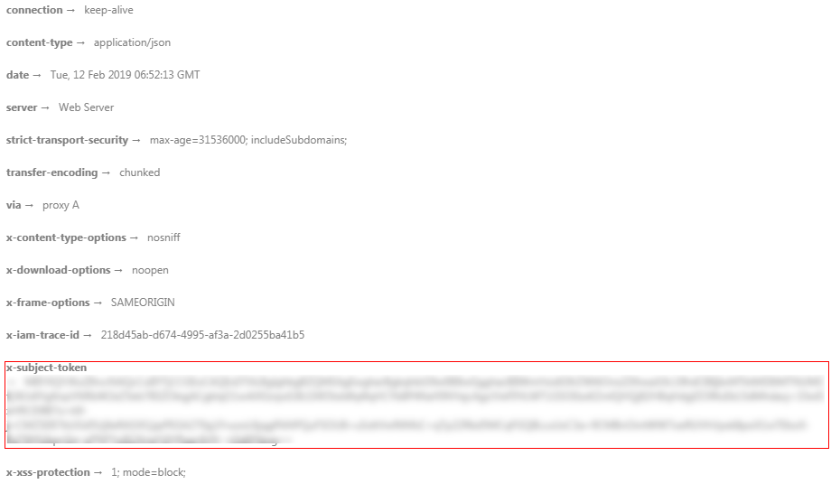

# 返回结果<a name="mrs_02_0010"></a>

## 状态码<a name="s9298dcd3b367405f919a492086eabe96"></a>

请求发送以后，您会收到响应，包含状态码、响应消息头和消息体。

状态码是一组从1xx到5xx的数字代码，状态码表示了请求响应的状态，完整的状态码列表请参见[状态码](状态码.md)。

对于[获取用户Token](https://support.huaweicloud.com/api-iam/iam_30_0001.html)接口，如果调用后返回状态码为“201“，则表示请求成功。

## 响应消息头<a name="sa5448f16aea64cb8887775f59b6a026a"></a>

对应请求消息头，响应同样也有消息头，如“Content-Type“。

对于[获取用户Token](https://support.huaweicloud.com/api-iam/iam_30_0001.html)接口，返回如[图1](#f08cfe198b8754981b2c3109cbde4967c)所示的消息头，其中“x-subject-token“就是需要获取的用户Token。有了Token之后，您就可以使用Token认证调用其他API。

**图 1**  获取用户Token响应消息头<a name="f08cfe198b8754981b2c3109cbde4967c"></a>  


## 响应消息体（可选）<a name="s1f19c657c2f940f0af3a62d3094bc037"></a>

该部分可选。响应消息体通常以结构化格式（如JSON或XML）返回，与响应消息头中Content-Type对应，传递除响应消息头之外的内容。

对于[获取用户Token](https://support.huaweicloud.com/api-iam/iam_30_0001.html)接口，返回如下消息体。为篇幅起见，这里只展示部分内容。

```
{
    "token": {
        "expires_at": "2019-02-13T06:52:13.855000Z",
        "methods": [
            "password"
        ],
        "catalog": [
            {
                "endpoints": [
                    {
                        "region_id": "aaa", //假设区域名称是“aaa”
......
```

当接口调用出错时，会返回错误码及错误信息说明，错误响应的Body体格式如下所示。

```
{
    "error_msg": "Invalid cluster name.",
    "error_code": "12000002"
}
```

其中，error\_code表示错误码，error\_msg表示错误描述信息。

