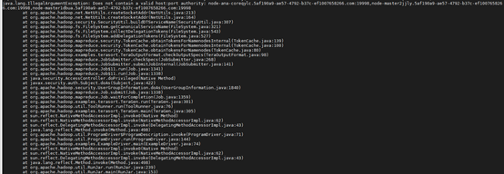

# Alluixo在HA模式下出现Does not contain a valid host:port authority报错

## 用户问题

安全集群Alluixo在HA模式下出现Does not contain a valid host:port authority的报错，如何处理？

## 问题现象

安全集群中，Alluixo在HA模式下出现Does not contain a valid host:port authority的报错。

## 原因分析

org.apache.hadoop.security.SecurityUtil.buildDTServiceName不支持在uri中填写多个alluxiomaster的地址。

## 处理步骤

使用alluxio:///或者alluxio://<主AlluxioMaster的ip或hostname\>:19998/进行访问。

