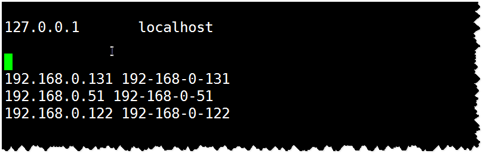
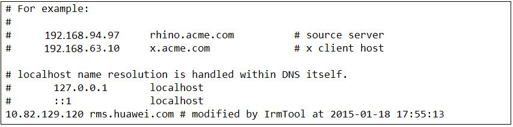
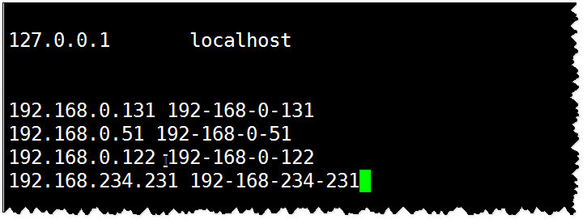
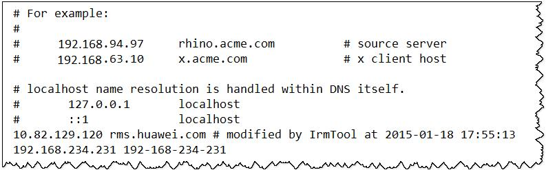

# Consumer初始化成功，但是无法从Kafka中获取指定Topic消息<a name="mrs_03_0063"></a>

## 问题背景与现象<a name="zh-cn_topic_0167275928_sf1db540c14e54778b6b4d6c6c2200ca7"></a>

使用MRS安装集群，主要安装ZooKeeper、Flume、Kafka、Storm、Spark。

使用Storm、Spark、Flume或者自己编写consumer代码来消费Kafka中指定Topic的消息时，发现消费不到任何数据。

## 可能原因<a name="zh-cn_topic_0167275928_sff692408050e45bda67f4644efabe3f1"></a>

1.  Kafka服务异常。
2.  Consumer中ZooKeeper相关连接地址配置错误，导致无法消费。
3.  Consumer发生ConsumerRebalanceFailedException异常，导致无法消费。
4.  Consumer发生网络导致的ClosedChannelException异常，导致无法消费。

## 原因分析<a name="zh-cn_topic_0167275928_sda1fa700b23b46be9d5f5adfb2943e40"></a>

Storm、Spark、Flume或者自定义Consumer代码可以都称为Consumer。

1.  查看kafka服务状态：
    -   MRS Manager界面操作：登录MRS Manager，依次选择 "服务管理 \> Kafka ，查看当前Kafka状态，发现状态为良好，且监控指标内容显示正确。
    -   FusionInsight Manager界面操作：登录FusionInsight Manager，选择“集群 \>  _待操作集群的名称_  \> 服务 \> Kafka，

        查看当前Kafka状态，发现状态为良好，且监控指标内容显示正确。

2.  通过Kafka Client，判断是否可以正常消费数据。

    假设客户端已经安装在/opt/client目录，test为需要消费的Topic名称， 192.168.234.231为ZooKeeper的IP地址。

    ```
    cd /opt/client
    source bigdata_env
    kinit admin
    kafka-topics.sh --zookeeper 192.168.234.231:2181/kafka --describe --topic testkafka-console-consumer.sh --topic test --zookeeper 192.168.234.231:2181/kafka --from-beginning
    ```

    当可以消费到数据时，表示集群服务正常。

3.  查看Consumer相关配置，发现ZooKeeper连接地址错误。

    -   Flume

        ```
        server.sources.Source02.type=org.apache.flume.source.kafka.KafkaSource                                            
        server.sources.Source02.zookeeperConnect=192.168.234.231:2181
        server.sources.Source02.topic = test
        server.sources.Source02.groupId = test_01
        ```

    -   Spark

        ```
        val zkQuorum = "192.168.234.231:2181"
        ```

    -   Storm

        ```
        BrokerHosts brokerHosts = new ZKHosts("192.168.234.231:2181");
        ```

    -   Consumer API

        ```
        zookeeper.connect="192.168.234.231:2181"
        ```

    MRS中Kafka在ZooKeeper存储的ZNode是以/kafka为根路径，有别于开源。Kafka对应的ZooKeeper连接配置为192.168.234.231:2181/kafka。

    Consumer中配置为ZooKeeper连接配置为192.168.234.231:2181，导致无法正确获取Kafka中Topic相关信息。

    解决方法参考[1](#zh-cn_topic_0167275928_lb8eac55f7edd4495a30abe4176d5cfc6)。

4.  查看Consumer相关日志，发现打印ConsumerRebalanceFailedException异常。

    ```
    2016-02-03 15:55:32,557 | ERROR | [ZkClient-EventThread-75- 192.168.234.231:2181/kafka] |  Error handling event ZkEvent[New session event sent to kafka.consumer.ZookeeperConsumerConnector$ZKSessionExpireListener@34b41dfe]  | org.I0Itec.zkclient.ZkEventThread.run(ZkEventThread.java:77)
    kafka.common.ConsumerRebalanceFailedException: pc-zjqbetl86-1454482884879-2ec95ed3 can't rebalance after 4 retries
    at kafka.consumer.ZookeeperConsumerConnector$ZKRebalancerListener.syncedRebalance(ZookeeperConsumerConnector.scala:633)
    at kafka.consumer.ZookeeperConsumerConnector$ZKSessionExpireListener.handleNewSession(ZookeeperConsumerConnector.scala:487)
    at org.I0Itec.zkclient.ZkClient$4.run(ZkClient.java:472)
    at org.I0Itec.zkclient.ZkEventThread.run(ZkEventThread.java:71)
    ```

    通过异常信息，发现当前Consumer没有在指定的重试次数内完成Rebalance，使得Consumer没有被分配Kafka Topic-Partition，则无法消费消息。

    解决方法参考[3](#zh-cn_topic_0167275928_lf10183f3f37f48a0ae972dcb99f42b7b)。

5.  查看Consumer相关日志，发现打印Fetching topic metadata with correlation id 0 for topics \[Set\(test\)\] from broker \[id:26,host:192-168-234-231,port:9092\] failed错误信息和ClosedChannelException异常。

    ```
    [2016-03-04 03:33:53,047] INFO Fetching metadata from broker id:26,host: 192-168-234-231,port:9092 with correlation id 0 for 1 topic(s) Set(test) (kafka.client.ClientUtils$)
    [2016-03-04 03:33:55,614] INFO Connected to 192-168-234-231:21005 for producing (kafka.producer.SyncProducer)
    [2016-03-04 03:33:55,614] INFO Disconnecting from 192-168-234-231:21005 (kafka.producer.SyncProducer)
    [2016-03-04 03:33:55,615] WARN Fetching topic metadata with correlation id 0 for topics [Set(test)] from broker [id:26,host: 192-168-234-231,port:21005] failed (kafka.client.ClientUtils$)
    java.nio.channels.ClosedChannelException
    at kafka.network.BlockingChannel.send(BlockingChannel.scala:100)
    at kafka.producer.SyncProducer.liftedTree1$1(SyncProducer.scala:73)
    at kafka.producer.SyncProducer.kafka$producer$SyncProducer$$doSend(SyncProducer.scala:72)
    at kafka.producer.SyncProducer.send(SyncProducer.scala:113)
    at kafka.client.ClientUtils$.fetchTopicMetadata(ClientUtils.scala:58)
    at kafka.client.ClientUtils$.fetchTopicMetadata(ClientUtils.scala:93)
    at kafka.consumer.ConsumerFetcherManager$LeaderFinderThread.doWork(ConsumerFetcherManager.scala:66)
    at kafka.utils.ShutdownableThread.run(ShutdownableThread.scala:60)
    [2016-03-04 03:33:55,615] INFO Disconnecting from 192-168-234-231:21005 (kafka.producer.SyncProducer)
    ```

    通过异常信息，发现当前Consumer无法从Kafka Broker 192-168-234-231节点获取元数据，导致无法连接正确的Broker获取消息。

6.  检查网络是否存在问题，如果网络没有问题，检查是否配置主机和IP的对应关系
    -   Linux

        执行**cat /etc/hosts**命令。

        **图 1**  示例1<a name="zh-cn_topic_0167275928_fig4806755115710"></a>  
        

    -   Windows

        打开“C:\\Windows\\System32\\drivers\\etc\\hosts”。

        **图 2**  示例2<a name="zh-cn_topic_0167275928_fig523014715814"></a>  
        

        解决方法参考[4](#zh-cn_topic_0167275928_l4532ac33f2904f39bfe3928758c4a8b4)。


## 解决办法<a name="zh-cn_topic_0167275928_s15ead4b064bc461ead26cc81ef028584"></a>

1.  <a name="zh-cn_topic_0167275928_lb8eac55f7edd4495a30abe4176d5cfc6"></a>ZooKeeper连接地址配置错误。
2.  修改Consumer配置中的ZooKeeper连接地址信息，保证和MRS相一致。
    -   Flume

        ```
        server.sources.Source02.type=org.apache.flume.source.kafka.KafkaSource
        server.sources.Source02.zookeeperConnect=192.168.234.231:2181/kafka
        server.sources.Source02.topic = test
        server.sources.Source02.groupId = test_01
        ```

    -   Spark

        ```
        val zkQuorum = "192.168.234.231:2181/kafka"
        ```

    -   Storm

        ```
        BrokerHosts brokerHosts = new ZKHosts("192.168.234.231:2181/kafka");
        ```

    -   Consumer API

        ```
        zookeeper.connect="192.168.234.231:2181/kafka"
        ```

3.  <a name="zh-cn_topic_0167275928_lf10183f3f37f48a0ae972dcb99f42b7b"></a>Rebalance异常。

    同一个消费者组\(consumer group\)有多个consumer先后启动，就是一个消费者组内有多个consumer同时消费多个partition数据，consumer端也会有负载均衡（consumer个数小于partitions数量时）。

    consumer实际上是靠存储在zk中的临时节点来表明针对哪个topic的那个partition拥有读权限的。所在路径为：/consumers/consumer-group-xxx/owners/topic-xxx/x。

    当触发负载均衡后，原来的consumer会重新计算并释放已占用的partitions，此过程需要一定的处理时间，新来的consumer抢占该partitions时很有可能会失败。 

    **表 1**  参数说明

    <a name="zh-cn_topic_0167275928_tab65f5050672431e829d12b2d6a96176"></a>
    <table><thead align="left"><tr id="zh-cn_topic_0167275928_red343144e7f147d3be4f5fac4d832b33"><th class="cellrowborder" valign="top" width="33.33333333333333%" id="mcps1.2.4.1.1"><p id="zh-cn_topic_0167275928_afe68b53aaeb34bac9c9aeaa437653f44"><a name="zh-cn_topic_0167275928_afe68b53aaeb34bac9c9aeaa437653f44"></a><a name="zh-cn_topic_0167275928_afe68b53aaeb34bac9c9aeaa437653f44"></a>名称</p>
    </th>
    <th class="cellrowborder" valign="top" width="33.33333333333333%" id="mcps1.2.4.1.2"><p id="zh-cn_topic_0167275928_accb59033c1c249d083a179bc692756e4"><a name="zh-cn_topic_0167275928_accb59033c1c249d083a179bc692756e4"></a><a name="zh-cn_topic_0167275928_accb59033c1c249d083a179bc692756e4"></a>作用</p>
    </th>
    <th class="cellrowborder" valign="top" width="33.33333333333333%" id="mcps1.2.4.1.3"><p id="zh-cn_topic_0167275928_af96748f46dc4446190533a7f3ecd0ba1"><a name="zh-cn_topic_0167275928_af96748f46dc4446190533a7f3ecd0ba1"></a><a name="zh-cn_topic_0167275928_af96748f46dc4446190533a7f3ecd0ba1"></a>默认值</p>
    </th>
    </tr>
    </thead>
    <tbody><tr id="zh-cn_topic_0167275928_r593d5aebed9f4be19ebdb0db19b1e4c1"><td class="cellrowborder" valign="top" width="33.33333333333333%" headers="mcps1.2.4.1.1 "><p id="zh-cn_topic_0167275928_ae1c0d751c8e645e5856eecf7898cf4d8"><a name="zh-cn_topic_0167275928_ae1c0d751c8e645e5856eecf7898cf4d8"></a><a name="zh-cn_topic_0167275928_ae1c0d751c8e645e5856eecf7898cf4d8"></a>rebalance.max.retries</p>
    </td>
    <td class="cellrowborder" valign="top" width="33.33333333333333%" headers="mcps1.2.4.1.2 "><p id="zh-cn_topic_0167275928_a0a165e09170246a3971f76b777c40382"><a name="zh-cn_topic_0167275928_a0a165e09170246a3971f76b777c40382"></a><a name="zh-cn_topic_0167275928_a0a165e09170246a3971f76b777c40382"></a>Rebalance最大重试次数</p>
    </td>
    <td class="cellrowborder" valign="top" width="33.33333333333333%" headers="mcps1.2.4.1.3 "><p id="zh-cn_topic_0167275928_aeadda4de1586456094ea6347945b5db8"><a name="zh-cn_topic_0167275928_aeadda4de1586456094ea6347945b5db8"></a><a name="zh-cn_topic_0167275928_aeadda4de1586456094ea6347945b5db8"></a>4</p>
    </td>
    </tr>
    <tr id="zh-cn_topic_0167275928_r4581a6eecf5c41219439977859ae82a5"><td class="cellrowborder" valign="top" width="33.33333333333333%" headers="mcps1.2.4.1.1 "><p id="zh-cn_topic_0167275928_a2b3a8f817c50486a8fc7faba1af44d56"><a name="zh-cn_topic_0167275928_a2b3a8f817c50486a8fc7faba1af44d56"></a><a name="zh-cn_topic_0167275928_a2b3a8f817c50486a8fc7faba1af44d56"></a>rebalance.backoff.ms</p>
    </td>
    <td class="cellrowborder" valign="top" width="33.33333333333333%" headers="mcps1.2.4.1.2 "><p id="zh-cn_topic_0167275928_ac4da6167f8fe4b62b13d4eba1bd3e4d5"><a name="zh-cn_topic_0167275928_ac4da6167f8fe4b62b13d4eba1bd3e4d5"></a><a name="zh-cn_topic_0167275928_ac4da6167f8fe4b62b13d4eba1bd3e4d5"></a>Rebalance每次重试间隔</p>
    </td>
    <td class="cellrowborder" valign="top" width="33.33333333333333%" headers="mcps1.2.4.1.3 "><p id="zh-cn_topic_0167275928_a16829d749005408ba42fcfc22e977f50"><a name="zh-cn_topic_0167275928_a16829d749005408ba42fcfc22e977f50"></a><a name="zh-cn_topic_0167275928_a16829d749005408ba42fcfc22e977f50"></a>2000</p>
    </td>
    </tr>
    <tr id="zh-cn_topic_0167275928_r9de1129f85b246cb89237dcba4e04d8c"><td class="cellrowborder" valign="top" width="33.33333333333333%" headers="mcps1.2.4.1.1 "><p id="zh-cn_topic_0167275928_a20f207a7f9264103b095b9342a6187f7"><a name="zh-cn_topic_0167275928_a20f207a7f9264103b095b9342a6187f7"></a><a name="zh-cn_topic_0167275928_a20f207a7f9264103b095b9342a6187f7"></a>zookeeper.session.timeout.ms</p>
    </td>
    <td class="cellrowborder" valign="top" width="33.33333333333333%" headers="mcps1.2.4.1.2 "><p id="zh-cn_topic_0167275928_ab1d3975242754f79b3cb66a3a8c1b130"><a name="zh-cn_topic_0167275928_ab1d3975242754f79b3cb66a3a8c1b130"></a><a name="zh-cn_topic_0167275928_ab1d3975242754f79b3cb66a3a8c1b130"></a>Zookeeper连接会话超时时间</p>
    </td>
    <td class="cellrowborder" valign="top" width="33.33333333333333%" headers="mcps1.2.4.1.3 "><p id="zh-cn_topic_0167275928_af408bdc2bbeb4e1ba32de3433418817e"><a name="zh-cn_topic_0167275928_af408bdc2bbeb4e1ba32de3433418817e"></a><a name="zh-cn_topic_0167275928_af408bdc2bbeb4e1ba32de3433418817e"></a>15000</p>
    </td>
    </tr>
    </tbody>
    </table>

    可以适当调大上述三个参数，可以参考如下数值：

    ```
    zookeeper.session.timeout.ms = 45000
    rebalance.max.retries = 10
    rebalance.backoff.ms = 5000
    ```

    参数设置应遵循：

    **rebalance.max.retries \* rebalance.backoff.ms \> zookeeper.session.timeout.ms**

4.  <a name="zh-cn_topic_0167275928_l4532ac33f2904f39bfe3928758c4a8b4"></a>网络异常。

    在hosts文件中没有配置主机名和IP的对应关系，导致使用主机名进行访问时，无法获取信息。

5.  在hosts文件中添加对应的主机名和IP的对应关系。
    -   Linux

        **图 3**  示例3<a name="zh-cn_topic_0167275928_fig980313875911"></a>  
        

    -   Windows

        **图 4**  示例4<a name="zh-cn_topic_0167275928_fig145361416205918"></a>  
        


