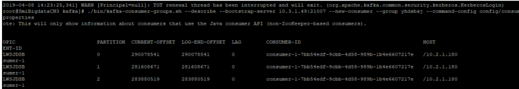

# Consumer消费数据是否丢失排查

## 问题背景与现象

客户将消费完的数据存入数据库，发现数据与生产数据不一致，怀疑Kafka消费丢数据

## 可能原因

-   客户代码原因
-   Kafka生产数据写入异常
-   Kafka消费数据异常

## 解决办法

Kafka排查：

1.  通过consumer-groups.sh来观察写入和消费的offerset的变化情况（生产一定数量的消息，客户端进行消费，观察offerset的变化）。

    

2.  新建一个消费组，用客户端进行消费，然后查看消费的消息。

    new-consumer:

    kafka-console-consumer.sh --topic <topic name\> --bootstrap-server <IP1:PORT, IP2:PORT,...\> --new-consumer --consumer.config <config file\>

客户代码排查：

1.  查看客户端里有没有提交offerset的报错。
2.  如果没有报错把消费的API里加上打印消息，打印少量数据（只打印key即可），查看丢失的数据。

