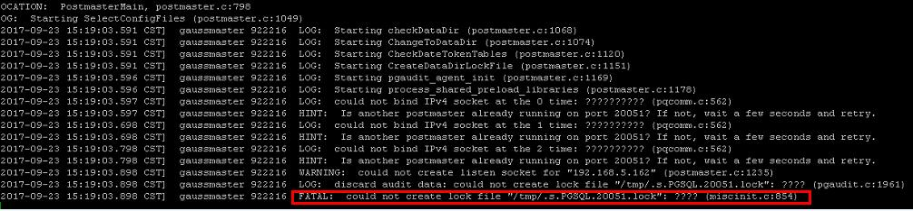
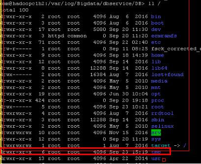

# DBServer启动失败

## 问题背景与现象

DBService组件启动失败，重启还是失败，实例状态一直为正在恢复状态。

**图 1**  DBService 的状态  

## 原因分析

1.  查看DBService的日志/var/log/Bigdata/dbservice/DB/gs\_ctl-current.log，报如下错误。

    

2.  检查发现/tmp权限不正确，正确的权限应该为777。

    

## 解决办法

1.  修改/tmp权限为777。
2.  重新启动DBService组件。

