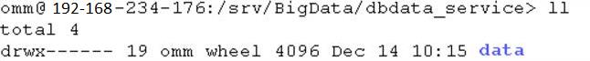
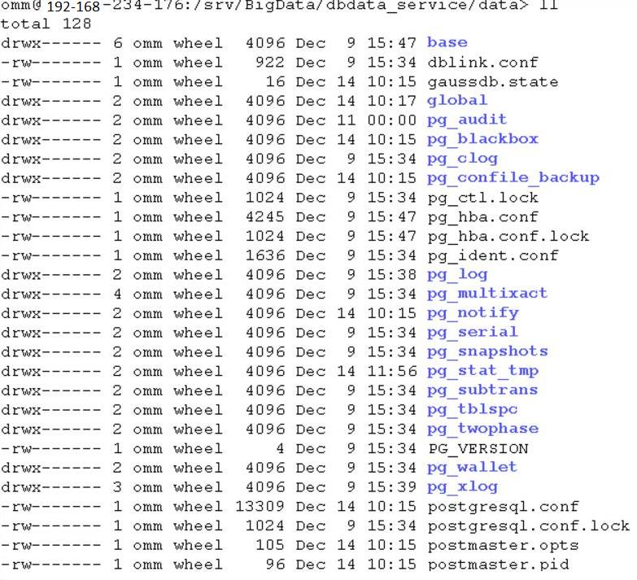

# DBServer实例状态异常

## 问题背景与现象

DBServer实例状态一直是concerning。

**图 1**  DBServer实例状态  

## 原因分析

数据目录下文件或目录的权限不对，GaussDB要求文件权限至少是600，目录权限至少为700。

**图 2**  目录权限列表  

**图 3**  文件权限列表  

## 解决办法

1.  按照[图2](#zh-cn_topic_0167275972_fig1343814172353)和[图3](#zh-cn_topic_0167275972_fig12759620123517)的权限列表，修改相应文件和目录的权限。
2.  重启相应的DBServer实例。

