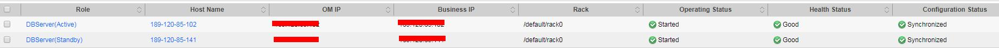

# DBService状态正常，组件无法连接DBService

## 问题背景与现象

上层组件连接DBService失败，检查DBService组件状态正常，两个实例状态也正常。

**图 1**  DBService状态  

## 原因分析

1.  上层组件是通过dbservice.floatip连接的DBService。
2.  在DBServer所在节点执行命令netstat -anp | grep 20051 发现，DBService的Gauss进程在启动时并未绑定floatip，只监听了127.0.0.1的本地ip。

## 解决办法

1.  登录MRS Manager。
2.  选择“服务管理 \> DBService”，单击“更多 \> 重启服务”，重新启动DBService组件。
3.  启动完成之后在主DBServer节点执行**netstat -anp | grep 20051**命令检查是否绑定了dbservice.floatip。

