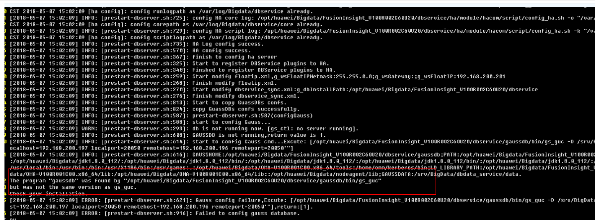
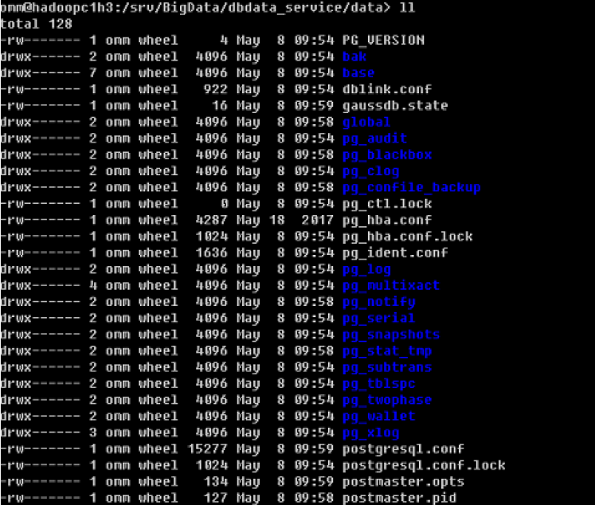
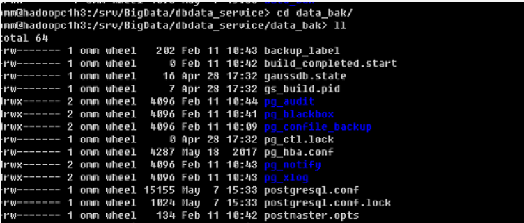

# DBService配置文件丢失导致启动失败<a name="mrs_03_0130"></a>

## 问题背景与现象<a name="zh-cn_topic_0167276152_sd64242caa665405798481482f49ab0ee"></a>

节点异常下电，重启备DBService失败。

## 原因分析<a name="zh-cn_topic_0167276152_s4871ca6d7a6b47b1a0f8266b84631f32"></a>

1.  查看/var/log/Bigdata/dbservice/DB/gaussdb.log日志没有内容。
2.  查看/var/log/Bigdata/dbservice/scriptlog/preStartDBService.log日志，发现如下信息，判断为配置信息丢失。

    ```
    The program "gaussdb" was found by "
    /opt/Bigdata/MRS_xxx/install/dbservice/gaussdb/bin/gs_guc)
    But not was not the same version as gs_guc.
    Check your installation.
    ```

    

3.  比对主备DBServer节点/srv/BigData/dbdata\_service/data目录下的配置文件发现差距比较大。

    

    


## 解决办法<a name="zh-cn_topic_0167276152_section1539215652120"></a>

1.  把主节点**/srv/BigData/dbdata\_service/data**的内容拷贝到备节点，保持文件权限和属组与主节点一样。
2.  修改postgresql.conf配置信息，localhost修改成本节点IP，remotehost修改成对端节点IP。

    

3.  登录Manager页面重启备DBServer节点。

