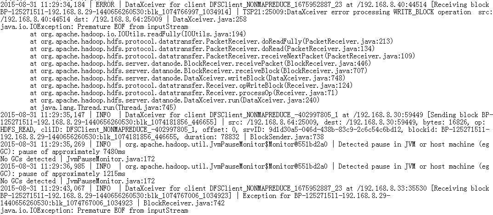

# DataNode概率性出现CPU占用接近100%，导致节点丢失（ssh连得很慢或者不上）

## 问题背景与现象

DataNode概率性出现CPU占用接近100%，导致节点丢失。

**图 1**  DataNode出现CPU占用接近100%  

## 原因分析

1.  DataNode有许多写失败的日志。

    **图 2**  DataNode写失败的日志  
    

2.  短时间内写入大量文件导致这种情况，因此DataNode内存不足。

    **图 3**  写入大量文件导致DataNode内存不足  
    

## 解决办法

1.  检查DataNode内存配置，以及机器剩余内存是否充足。
2.  增加DataNode内存，并重启DataNode。

