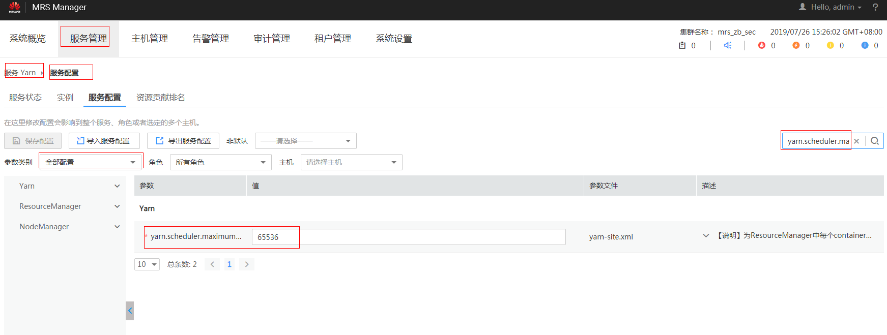

# Driver端提示executor memory超限<a name="ZH-CN_TOPIC_0183415849"></a>

## 问题背景与现象<a name="zh-cn_topic_0167275365_s0e15c6a5056e4e5a944630217779bd58"></a>

内存超限导致提交Spark任务失败。

## 原因分析<a name="zh-cn_topic_0167275365_sa22eaa966daa422e8c44b20264b07e78"></a>

在Driver日志中直接打印申请的executor memory超过集群限制。

```
16/02/06 14:11:25 INFO Client: Verifying our application has not requested more than the maximum memory capability of the cluster (6144 MB per container)
16/02/06 14:11:29 ERROR SparkContext: Error initializing SparkContext.
java.lang.IllegalArgumentException: Required executor memory (10240+1024 MB) is above the max threshold (6144 MB) of this cluster!
```

Spark任务提交至Yarn上面，运行task的executor使用的资源受yarn的管理。从报错信息可看出，用户申请启动executor时，指定10G的内存，超出了Yarn设置的每个container的最大内存的限制，导致任务无法启动。

## 解决办法<a name="zh-cn_topic_0167275365_s1b95eab534ef4eec98445b155d95d0f3"></a>

修改Yarn的配置，提高对container的限制。如可通过调整“yarn.scheduler.maximum-allocation-mb“参数的大小，可控制启动的executor的资源，修改之后要重启Yarn服务。

配置修改方法：

1.  登录MRS Manager页面
2.  单击“服务管理 \> Yarn \> 服务配置”将“参数类别”修改为“全部配置”。
3.  在“搜索”栏输入“yarn.scheduler.maximum-allocation-mb”修改参数并保存重启服务。如下图所示：

    **图 1**  修改Yarn服务参数<a name="zh-cn_topic_0167275365_fig11380183075910"></a>  
    


