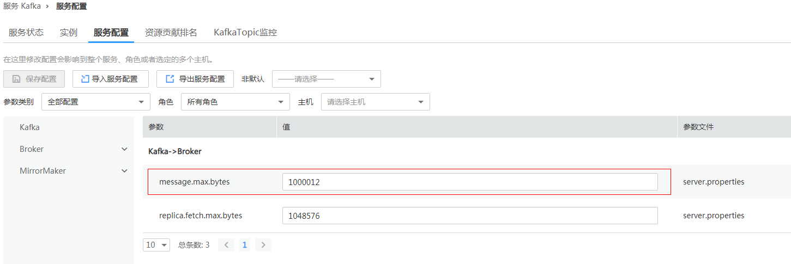
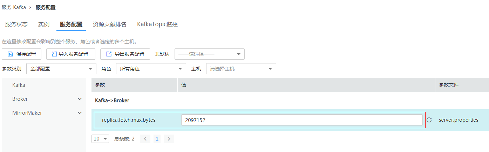
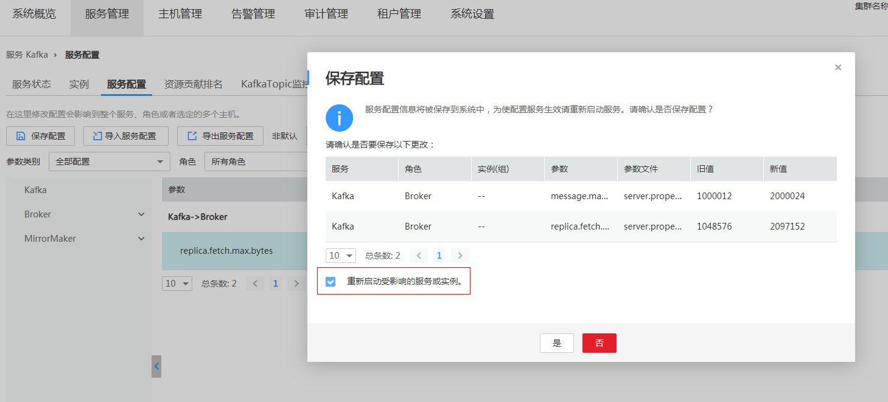

# Flume可以正常连接Kafka，但是发送消息失败。<a name="ZH-CN_TOPIC_0181626564"></a>

## 问题现象<a name="zh-cn_topic_0167274591_s8c5a413588744f3ea1320d012fdb73cb"></a>

使用MRS版本安装集群，主要安装ZooKeeper、Flume、Kafka。

在使用Flume向Kafka发送数据功能时，发现Flume发送数据到Kafka失败。

## 可能原因<a name="zh-cn_topic_0167274591_s32d34cd2ed084d9dbf63d1ca6576eea0"></a>

1.  Kafka服务异常。
2.  Flume连接Kafka地址错误，导致发送失败。
3.  Flume发送超过Kafka大小限制的消息，导致发送失败。

## 原因分析<a name="zh-cn_topic_0167274591_s76409f8bbc4041eb937f70bc8c0594bf"></a>

Flume发送数据到Kafka失败，可能原因是Flume侧问题或者Kafka侧问题。

1.  通过MRS Manager页面，点击Service-\>Kafka，查看当前Kafka集群当前状态，发现状态为良好，且监控指标内容显示正确。

    **图 1**  Kafka服务状态<a name="zh-cn_topic_0167274591_fig206768914366"></a>  
    

2.  查看Flume日志，发现打印MessageSizeTooLargeException异常信息，如下所示：

    ```
    2016-02-26 14:55:19,126 | WARN  | [SinkRunner-PollingRunner-DefaultSinkProcessor] |  Produce request with correlation id 349829 failed due to [LOG,7]: kafka.common.MessageSizeTooLargeException  | kafka.utils.Logging$class.warn(Logging.scala:83)
    ```

    通过异常信息，发现当前Flume向Kafka写入的数据超过了Kafka服务端定义的消息的最大值。

3.  通过MRS Manager查看Kafka服务端定义的消息的最大值。

    选择 服务-\>Kafka-\>服务配置，进入Kafka配置页面，点击右侧参数类别，选择全部配置，显示所有Kafka相关配置，在Search中输入message.max.bytes进行检索。

    **图 2**  服务配置<a name="zh-cn_topic_0167274591_fig111861032113614"></a>  
    

    如[图2](#zh-cn_topic_0167274591_fig111861032113614)所示，MRS中Kafka服务端默认可以接收的消息最大为1000012 bytes =977KB。


## 解决办法<a name="zh-cn_topic_0167274591_s2d3c010d3bc0406fa3f531ccd76c297f"></a>

与用户确认，当前Flume发送数据确实存在超过1M的消息。因此，为了确保当前这些消息能够写入Kafka，需要调整Kafka服务端相关参数。

1.  修改message.max.bytes，使得message.max.bytes \> 当前业务中消息最大值，使得Kafka服务端可以接收全部消息。message

    **图 3**  修改message.max.bytes<a name="zh-cn_topic_0167274591_fig139971140113714"></a>  
    

    [图3](#zh-cn_topic_0167274591_fig139971140113714)为示例，请根据实际情况进行调整。

2.  修改replica.fetch.max.bytes，使得replica.fetch.max.bytes \>= message.max.bytes，使得不同Broker上的Partition的Replica可以同步到全部消息。

    选择 服务-\>Kafka-\>服务配置，进入Kafka配置页面，点击右侧Type，选择All， 显示所有Kafka相关配置，在Search中输入replica.fetch.max.bytes进行检索。

    按[图4](#zh-cn_topic_0167274591_fig1132025173815)示例修改参数值，请根据实际情况进行调整。

    **图 4**  修改replica.fetch.max.bytes<a name="zh-cn_topic_0167274591_fig1132025173815"></a>  
    

3.  保存配置，并重启Kafka服务，使得Kafka相关配置生效。

    **图 5**  保存配置<a name="zh-cn_topic_0167274591_fig12950927133818"></a>  
    

4.  修改消费者业务应用中fetch.message.max.bytes，使得fetch.message.max.bytes \>= message.max.bytes，确保消费者可以消费到全部消息。

