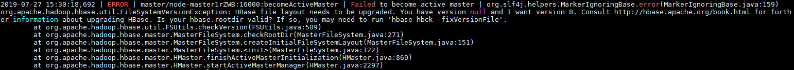

# HBase version文件损坏导致启动失败

## 问题背景

HBase启动失败。

## 原因分析

1.  HBase启动时会读取hbase.version文件，但是日志显示读取存在异常。

    

2.  通过**hadoop fs -cat  /hbase/hbase.version**命令发现文件不能正常查看，该文件损坏。

## 解决办法

1.  执行**hbase hbck -fixVersionFile**命令修复文件。
2.  如[1](#zh-cn_topic_0167274943_l6b279b8cf6a2455c95073287a2ccb7fa)不能解决，从同版本的其他集群中获取hbase.version文件上传进行替换。
3.  重新启动HBase服务。

