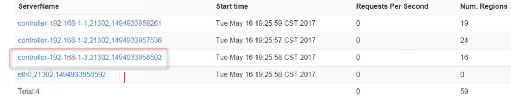
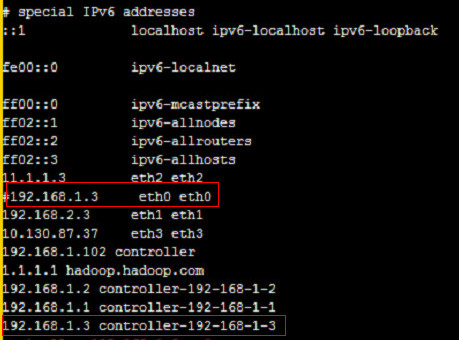

# HBase启动后原生页面显示RegionServer个数多于实际个数

## 问题背景

HBase启动后，HMaster原生页面显示RegionServer个数多于实际RegionServer个数。

查看HMaster原生页面，显示有4个RegionServer在线，如下图示：

## 原因分析

如下图可以看出，第三行hostname为controller-192-168-1-3节点和第四行hostname为eth0节点为同一RegionServer上报的信息，登录相应节点，查看/etc/hosts文件，发现，对应同一ip，配置两个hostname。如下：

## 解决办法

登录RegionServer所在节点，修改/etc/hosts文件，同一ip只能对应同一hostname。

