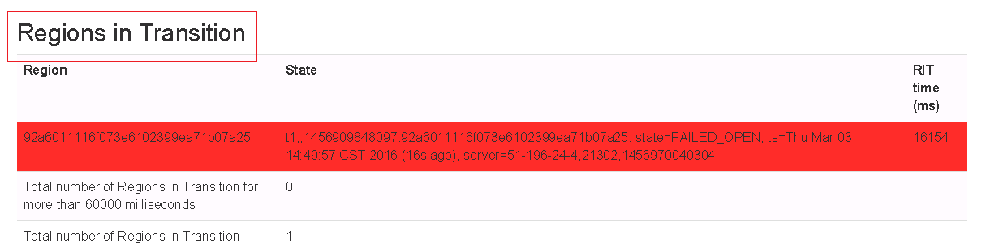

# HBase的initial超时保留导致启动失败

## 问题现象

MRS 1.5.x版本，HBase启动失败提示初始化超时。

## 原因分析

因为之前残留大量RIT事务，而参数“hbase.master.initializationmonitor.timeout“默认300秒，该时间内还未来得及完成初始化，导致Hmater进程主动退出。

## 解决办法

1.  登录MRS Manager页面，选择“服务管理 \> HBase \> 服务配置”，进入HBase配置页面。
2.  “参数类别“选择“全部配置“， 搜索并修改“hbase.master.initializationmonitor.timeout“参数，将参数增大（比如临时改成30分钟）。
3.  单击“保存配置”，勾选“重新启动受影响的服务或实例。”并单击“确定”重启服务。

