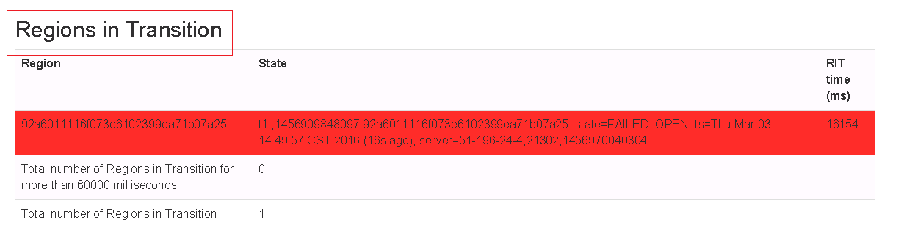

# HBase的initial超时保留导致启动失败

## 问题现象

MRS 1.5.x版本，HBase启动失败提示初始化超时。

## 原因分析

因为之前残留大量RIT事务，而参数“hbase.master.initializationmonitor.timeout“默认300秒，该时间内还未来得及完成初始化，导致Hmater进程主动退出。

## 解决办法

1.  进入HBase服务配置页面：
    -   MRS 1.8.10及之前版本，登录MRS Manager页面，具体请参见[访问MRS Manager](https://support.huaweicloud.com/usermanual-mrs/mrs_01_0102.html)，然后选择“服务管理 \> HBase \> 服务配置”，单击“基础配置”下拉菜单，选择“全部配置”。
    -   MRS 1.8.10之后及2._x_版本，单击集群名称，登录集群详情页面，选择“组件管理 \> HBase \> 服务配置”，单击“基础配置”下拉菜单，选择“全部配置”。

        > **说明：** 
        >若集群详情页面没有“组件管理”页签，请先完成IAM用户同步（在集群详情页的“概览”页签，单击“IAM用户同步“右侧的“同步”进行IAM用户同步）。

    -   MRS 3.x及后续版本，登录FusionInsight Manager，然后选择“集群 \>  _待操作的集群名_称 \> 服务 \> HBase \> 配置 \> 全部配置”。

2.  搜索并修改“hbase.master.initializationmonitor.timeout“参数，将参数增大（比如临时改成30分钟）。
3.  保存配置并重启受影响的服务或实例。

