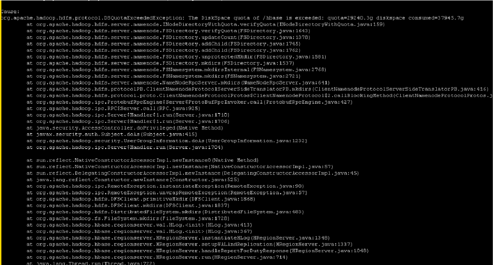

# HDFS上设置配额导致HBase启动失败

## 问题现象

HBase启动失败。

## 原因分析

查看HMaster日志信息（“/var/log/Bigdata/hbase/hm/hbase-omm-xxx.log“），出现如下异常，The DiskSpace quota of /hbase is exceeded。

## 解决办法

1.  通过后台使用**df -h**命令查看数据盘目录空间已满，因此需要删除无用的数据来进行应急恢复。
2.  后续需要扩容节点来解决数据目录空间不足问题。

