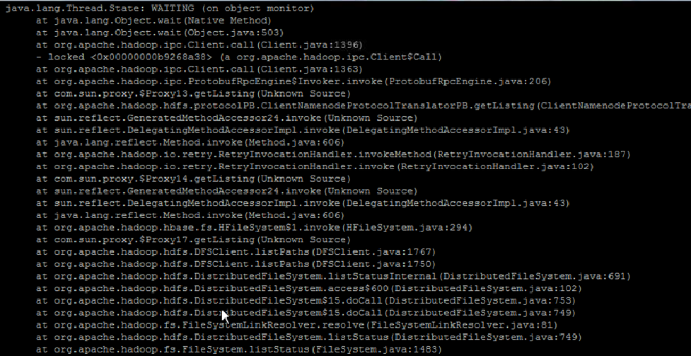

# HDFS性能差导致HBase服务不可用告警

## 问题现象

HBase组件断断续续上报服务不可用告警。

## 原因分析

该问题多半为HDFS性能较慢，导致健康检查超时，从而导致监控告警。可通过以下方式判断：

1.  首先查看HMaster日志（“/var/log/Bigdata/hbase/hm/hbase-omm-xxx.log“），确认HMaster日志中没有频繁打印“system pause”或“jvm”等GC相关信息。
2.  然后可以通过下列三种方式确认原因为HDFS性能慢造成告警产生。
    1.  使用客户端验证，通过**hbase shell**进入hbase命令行后，执行**list**验证需要运行多久。
    2.  开启HDFS的debug日志，然后查看下层目录很多的路径（**hadoop fs –ls /XXX/XXX**），验证需要运行多久。
    3.  打印HMaster进程jstack：

        **su - omm**

        **jps**

        **jstack pid**

3.  如下图所示，Jstack显示一直卡在DFSClient.listPaths。

    **图 1**  异常  
    

## 解决办法

1.  如果确认是HDFS性能慢导致告警，需要排除是否为旧版本中Impala运行导致HDFS性能慢或者是否为集群最初部署时JournalNode部署不正确（部署过多，大于3个）。

