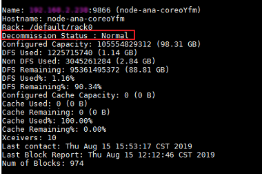

# HDFS的DataNode一直显示退服中

## 用户问题

HDFS的DataNode一直显示退服中。

## 问题现象

HDFS的某个DataNode退服（或者对Core节点进行缩容）任务失败，但是DataNode在任务失败后一直处于退服中的状态。

## 原因分析

在对HDFS的某个DataNode进行退服（或者对core节点进行缩容）过程中，因为Master节点重启或者nodeagent进程意外退出等情况出现，使得退服（或缩容）任务失败，并且没有进行黑名单清理。此时DataNode节点会一直处于退服中的状态，需要人工介入进行黑名单清理。

## 处理步骤

1.  进入服务实例界面。

    MRS Manager界面操作：

    登录MRS Manager，在MRS Manager页面，选择“服务管理 \> HDFS \> 实例”。

    FusionInsight Manager界面操作：

    对于MRS 3.x及后续版本集群：也可登录FusionInsight Manager。选择“集群 \> 服务 \> HDFS \> 实例”。

    也可登录MRS控制台，选择“组件管理 \> HDFS \> 实例”。

2.  查看HDFS服务实例状态，找到一直处于退服中的DataNode，复制这个DataNode的IP地址。
3.  登录Master1节点的后台，执行**cd $\{BIGDATA\_HOME\}/MRS\_\*/1\_\*\_NameNode/etc/**命令进入黑名单目录。
4.  执行**sed -i "/^_IP_$/d" excludeHosts**命令清理黑名单中的故障DataNode信息，该命令中IP替换为[2](#li7526181719251)中查询到的故障DataNode的IP地址，其中不能有空格。
5.  如果有两个Master节点，请在Master2节点上同样执行[3](#li952771732518)和[4](#li20527141722513)。
6.  在Master1节点执行如下命令初始化环境变量。

    **source /opt/client/bigdata\_env**

7.  如果当前集群已启用Kerberos认证，执行以下命令认证当前用户。如果当前集群未启用Kerberos认证，则无需执行此命令。

    **kinit** **_MRS__集群用户_**

    例如,  **kinit admin**

8.  在Master1节点执行如下命令刷新HDFS的黑名单。

    **hdfs dfsadmin -refreshNodes**

9.  使用命令**hdfs dfsadmin -report**来查看各个DataNode的状态，确认中查到的IP对应的DataNode已经恢复为**Normal**状态。

    **图 1**  DataNode的状态  
    

10. 进入服务实例界面。

    MRS Manager界面操作：

    登录MRS Manager，在MRS Manager页面，选择“服务管理 \> HDFS \> 实例”。

    FusionInsight Manager界面操作：

    对于MRS 3.x及后续版本集群：可登录FusionInsight Manager。选择“集群 \> 服务 \> HDFS \> 实例”。

    登录MRS控制台，选择“组件管理 \> HDFS \> 实例”。

11. 勾选一直处于退服中的DataNode实例，单击“更多 \> 重启实例”。
12. 等待重启完成，确认DataNode是否恢复正常。

## 建议与总结

尽量不要在退服（或缩容）过程中重启节点等高危操作。

## 参考信息

无

