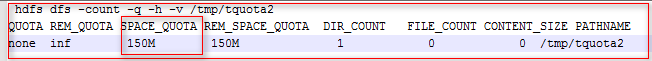

# HDFS目录配额（quota）不足导致写文件失败<a name="ZH-CN_TOPIC_0181713169"></a>

## 问题背景与现象<a name="zh-cn_topic_0167275765_sd1dc17fee2214ed9867d242a14f38d7d"></a>

给某目录设置quota后，往目录中写文件失败，出现如下问题“**The DiskSpace quota of** /tmp/tquota2 is **exceeded**”

```
[omm@189-39-150-115 client]$ 
[omm@189-39-150-115 client]$ hdfs dfs -put switchuser.py  /tmp/tquota2
put: The DiskSpace quota of /tmp/tquota2 is exceeded: quota = 157286400 B = 150 MB but diskspace consumed = 402653184 B = 384 MB
```

## 可能原因<a name="zh-cn_topic_0167275765_sf4a7e0ba1ac14d3cb1db306143d1b51c"></a>

目录配置的剩余的空间小于写文件实际需要的空间。

## 原因分析<a name="zh-cn_topic_0167275765_s36d0a1c802044398ada37b44f5dced4e"></a>

1.  HDFS支持设置某目录的配额，即限制某目录下的文件最多占用空间大小，例如如下命令是设置/tmp/tquota 目录最多写入150MB的文件（文件大小\*副本数）。

    **hadoop dfsadmin -setSpaceQuota  150M /tmp/tquota2**

2.  使用如下命令可以查看目录设置的配额情况，SPACE\_QUOTA是设置的空间配额，REM\_SPACE\_QUOTA是当前剩余的空间配额。

    **hdfs dfs -count -q -h -v /tmp/tquota2**

    **图 1**  查看目录设置的配额<a name="zh-cn_topic_0167275765_fig1982928115312"></a>  
    

3.  日志分析，如下日志说明写入文件需要消耗384M，但是当前的空间配额是150M，因此空间不足。写文件前，需要的剩余空间是：块大小\*副本数，128M\*3副本=384M。

    ```
    [omm@189-39-150-115 client]$ 
    [omm@189-39-150-115 client]$ hdfs dfs -put switchuser.py  /tmp/tquota2
    put: The DiskSpace quota of /tmp/tquota2 is exceeded: quota = 157286400 B = 150 MB but diskspace consumed = 402653184 B = 384 MB
    ```


## 解决办法<a name="zh-cn_topic_0167275765_s72ccbb40aaab4b2d8bdeebae39f52199"></a>

1.  增加配额大小，即重新设置目录的配额大小。

    **hadoop dfsadmin -setSpaceQuota  150G /目录名**

2.  清空配额。

    **hdfs dfsadmin -clrSpaceQuota /目录名**


