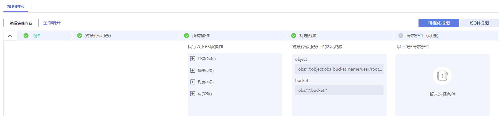

# Hadoop客户端删除OBS上数据时.Trash目录没有权限<a name="mrs_03_0227"></a>

## 用户问题<a name="section18305143583116"></a>

使用Hadoop客户端删除OBS上数据时出现.Trash目录没有权限的报错。

## 问题现象<a name="section117424454313"></a>

执行**hadoop fs -rm obs://<obs\_path\>**出现如下报错：

```
exception [java.nio.file.AccessDeniedException: user/root/.Trash/Current/: getFileStatus on user/root/.Trash/Current/: status [403]
```

## 原因分析<a name="section1237061220324"></a>

hadoop删除文件时会将文件先移动到.Trash目录，若该目录没有权限则出现403报错。

## 处理步骤<a name="section11365635122812"></a>

方案一：

使用**hadoop fs -rm -skipTrash**来删除文件。

方案二：

在集群对应的委托中添加访问.Trash目录的权限。

1.  <a name="li5623132122112"></a>在集群“概览”页签中，查询并记录集群所绑定的委托名称。
2.  登录IAM服务控制台。
3.  <a name="li18820555152219"></a>选择“权限 \> 创建自定义策略”。

    -   策略名称：请输入策略名称。
    -   作用范围：请选择“全局级服务”。
    -   策略配置方式：请选择“可视化视图”。
    -   策略内容：
        1.  “允许”选择“允许”。
        2.  “云服务”选择“对象存储服务 \(OBS\)”。
        3.  “操作”勾选所有操作权限。
        4.  “特定资源”选择：

            1.  “object”选择“通过资源路径指定”，并单击“添加资源路径”分别在“路径”中输入.Trash目录，例如**_obs\_bucket\_name_/user/root/.Trash/\***。
            2.  “bucket”选择“通过资源路径指定”，并单击“添加资源路径”在“路径”中输入**_obs\_bucket\_name_**。

            其中**obs\_bucket-name**请使用实际的OBS桶名替换。

        5.  （可选）请求条件，暂不添加。

    **图 1**  自定义策略<a name="fig12607163641518"></a>  
    

4.  单击“确定”完成策略添加。
5.  选择“委托”，并在[1](#li5623132122112)中查询到的委托所在行的“操作”列单击“权限配置”。
6.  查询并勾选[3](#li18820555152219)中创建的策略。
7.  单击“确定”完成委托权限配置。
8.  重新执行**hadoop fs -rm obs://<obs\_path\>**命令。

