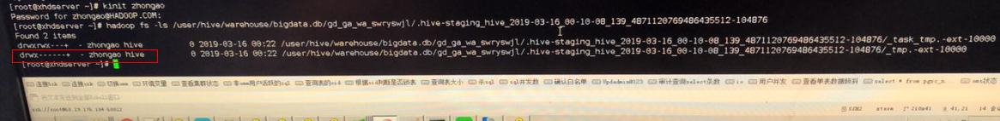

# Hive任务失败，报没有HDFS目录的权限<a name="mrs_03_0192"></a>

## 问题背景与现象<a name="zh-cn_topic_0167274487_section1511554917485"></a>

Hive任务报错，提示执行用户没有HDFS目录权限

```
2019-04-09 17:49:19,845 | ERROR | HiveServer2-Background-Pool: Thread-3160445 | Job Submission failed with exception 'org.apache.hadoop.security.AccessControlException(Permission denied: user=hive_quanxian, access=READ_EXECUTE, inode="/user/hive/warehouse/bigdata.db/gd_ga_wa_swryswjl":zhongao:hive:drwx------
at org.apache.hadoop.hdfs.server.namenode.FSPermissionChecker.checkAccessAcl(FSPermissionChecker.java:426)
at org.apache.hadoop.hdfs.server.namenode.FSPermissionChecker.check(FSPermissionChecker.java:329)
at org.apache.hadoop.hdfs.server.namenode.FSPermissionChecker.checkSubAccess(FSPermissionChecker.java:300)
at org.apache.hadoop.hdfs.server.namenode.FSPermissionChecker.checkPermission(FSPermissionChecker.java:241)
at com.huawei.hadoop.adapter.hdfs.plugin.HWAccessControlEnforce.checkPermission(HWAccessControlEnforce.java:69)
at org.apache.hadoop.hdfs.server.namenode.FSPermissionChecker.checkPermission(FSPermissionChecker.java:190)
at org.apache.hadoop.hdfs.server.namenode.FSDirectory.checkPermission(FSDirectory.java:1910)
at org.apache.hadoop.hdfs.server.namenode.FSDirectory.checkPermission(FSDirectory.java:1894)
at org.apache.hadoop.hdfs.server.namenode.FSDirStatAndListingOp.getContentSummary(FSDirStatAndListingOp.java:135)
at org.apache.hadoop.hdfs.server.namenode.FSNamesystem.getContentSummary(FSNamesystem.java:3983)
at org.apache.hadoop.hdfs.server.namenode.NameNodeRpcServer.getContentSummary(NameNodeRpcServer.java:1342)
at org.apache.hadoop.hdfs.protocolPB.ClientNamenodeProtocolServerSideTranslatorPB.getContentSummary(ClientNamenodeProtocolServerSideTranslatorPB.java:925)
at org.apache.hadoop.hdfs.protocol.proto.ClientNamenodeProtocolProtos$ClientNamenodeProtocol$2.callBlockingMethod(ClientNamenodeProtocolProtos.java)
at org.apache.hadoop.ipc.ProtobufRpcEngine$Server$ProtoBufRpcInvoker.call(ProtobufRpcEngine.java:616)
at org.apache.hadoop.ipc.RPC$Server.call(RPC.java:973)
at org.apache.hadoop.ipc.Server$Handler$1.run(Server.java:2260)
at org.apache.hadoop.ipc.Server$Handler$1.run(Server.java:2256)
at java.security.AccessController.doPrivileged(Native Method)
at javax.security.auth.Subject.doAs(Subject.java:422)
at org.apache.hadoop.security.UserGroupInformation.doAs(UserGroupInformation.java:1781)
at org.apache.hadoop.ipc.Server$Handler.run(Server.java:2254)
)'
```

## 原因分析<a name="zh-cn_topic_0167274487_section1712535035913"></a>

1.  根据堆栈信息，可以看出在检查子目录的权限时失败。

    ```
    org.apache.hadoop.hdfs.server.namenode.FSPermissionChecker.checkSubAccess(FSPermissionChecker.java:300)
    ```

2.  检查HDFS上表目录下所有文件目录的权限，发现有一个目录权限为700（只有文件属主能够访问），确认存在异常目录。

    


## 解决办法<a name="zh-cn_topic_0167274487_section78323421615"></a>

1.  确认该文件是否为手动异常导入，如不是数据文件或目录，删除该文件或目录。
2.  当无法删除时，建议修改文件或目录权限为770。

