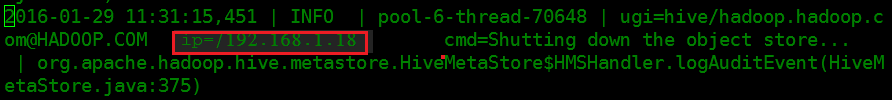

# Hive各个日志里都存放了什么信息？

## 审计日志

首先，对于审计日志来说，记录了某个时间点某个用户从哪个IP发起对HiveServer或者MetaStore的请求以及记录执行的语句是什么。

如下的HiveServer审计日志，表示在2016-02-01 14:51:22 用户user\_chen向HiveServer发起了show tables请求，客户端IP为192.168.1.18

如下面MetaStore审计日志，表示在2016-01-29 11:31:15 用户hive向MetaStore发起shutdown请求，客户端ip为192.168.1.18。

通常情况下，审计日志对我们定位实际错误信息并无太大帮助。但在遇到诸如下述类问题时，需要查看审计日志：

1.  如客户端发起请求，但是迟迟未得到响应。由于不确定到底是任务是卡在客户端还是服务端，可以通过审计日志查看。如果审计日志根本没有相关信息，那么说明卡死在客户端；如审计日志有相关打印，那么就需要去运行日志里看到底程序卡在哪一步了。
2.  查看指定时间段的任务请求个数。可通过审计日志查看在指定时间段到底有多少个请求。

## HiveServer运行日志

简言之，HiveServer负责接收客户端请求（SQL语句），然后编译、执行（提交到YRAN或运行local MR）、与MetaStore交互获取元数据信息等。HiveServer运行日志记录了一个SQL完整的执行过程。

通常情况下，当我们遇到SQL语句运行失败，我们首先要看的就是HiveServer运行日志。

## MetaStore运行日志

通常情况下，当我们遇到查看HiveServer运行日志时，如遇到MetaException或者连接MetaStore失败，我们就需要去看MetaStore运行日志了。

## GC日志查看

HiveServer和MetaStore均有GC日志，当我们遇到GC问题可以查看GC日志以快速定位是否是GC导致。如，当遇到HiveServer或MetaStore频繁重启就需要去看下对应的GC日志了。

