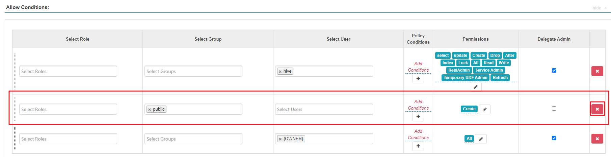
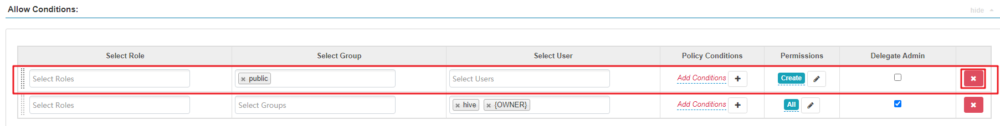

# Hive启用Ranger鉴权后，在Hue页面能查看到没有权限的表和库

## 用户问题

Hive启用Ranger鉴权后，在Hue页面能查看到没有权限的表和库

## 问题现象

普通集群（未开启Kerberos认证）中，Hive启用Ranger鉴权后，在Hue页面能查看到没有权限的表和库。

## 原因分析

Hive启用Ranger鉴权后，默认的Hive策略中有2个关于database的public组策略， 所有用户都属于public组，默认给public组配有default数据库的创表和所有其他数据库的**create**权限，因此默认所有的用户都有**show databases**和**show tables**的权限，如果不想让某些用户有**show databases**和**show tables**权限，可在Ranger WEBUI中删除该默认public组策略，并赋予需要查看的用户权限，具体请参考处理步骤。

## 处理步骤

1.  登录Ranger WebUI界面。
2.  在“Service Manager”区域内，单击Hive组件名称，进入Hive组件安全访问策略列表页面。
3.  分别单击“all - database”和“default database tables columns”策略所在行的按钮。
4.  删除“public”组策略。

    **图 1**  all - database策略  
    

    **图 2**  default database tables columns策略  
    

5.  在Hive组件安全访问策略列表页面，单击“Add New Policy”为相关用户或者用户组添加资源访问策略，具体请参考[配置组件权限策略](https://support.huaweicloud.com/cmpntguide-mrs/mrs_01_1851.html)。

