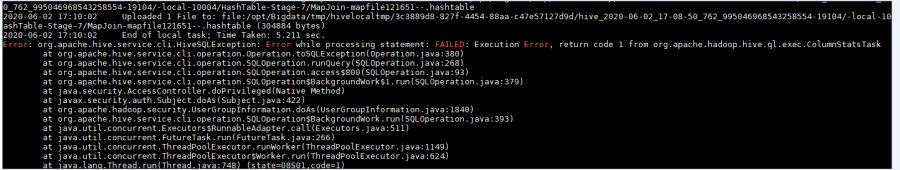
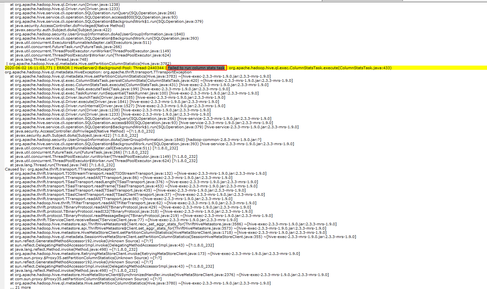
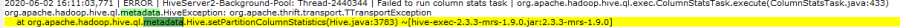
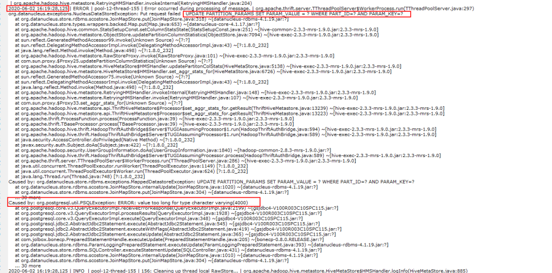

# Hive执行insert ino语句报错，命令界面报错信息不明<a name="mrs_03_0228"></a>

## 用户问题<a name="section18305143583116"></a>

客户使用MRS Hive执行一条SQL报错。

## 问题现象<a name="section117424454313"></a>

客户使用MRS Hive执行一条SQL，有如下报错：

**图 1**  使用MRS Hive执行SQL报错<a name="fig619245182313"></a>  


## 原因分析<a name="section1237061220324"></a>

1.  查看Hiveserver日志，在对应时间点，有如下的报错信息。

    **图 2**  Hiveserver日志<a name="fig8104349226"></a>  
    

2.  在如上报错信息中未发现重要信息，但从堆栈中发现metadata字样，怀疑报错是和metastore有关。

    **图 3**  堆栈中metadata字样<a name="fig16938101111309"></a>  
    

3.  查看metastore日志，发现如下报错。

    **图 4**  metastore日志<a name="fig15713712123210"></a>  
    

    查看如上错误的上下文，确定是本次执行SQL的报错，在报错信息里面发现如下内容：

    ```
    Caused by: org.postgresql.util.PSQLException: ERROR: value too long for type character varying(4000)
    ```

    确认是客户该条SQL对表的操作，所有列的字节长度超过4000的限制，导致SQL执行失败，需要修改该限制。


## 处理步骤<a name="section11365635122812"></a>

1.  以root用户登录集群任意一个Master节点，并执行**su - omm**命令切换到omm用户。
2.  执行如下命令登录高斯DB。

    **gsql -p 20051 -d hivemeta -U  _username_  -W  _password_**

3.  执行如下命令修改修改限制。

    **alter table PARTITION\_PARAMS alter column PARAM\_VALUE type varchar\(6000\);**


