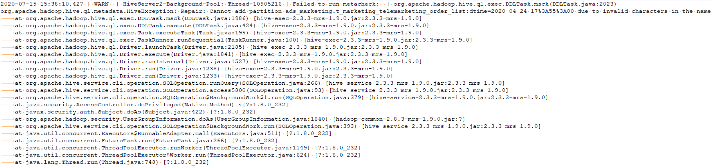

# Hive执行msck repair table table\_name报错

## 现象描述

Hive执行msck repair table table\_name报错：FAILED: Execution Error, return code 1 from org.apache.hadoop.hive.ql.exec.DDLTask \(state=08S01,code=1\)。

## 可能原因

查看HiveServer日志/var/log/Bigdata/hive/hiveserver/hive.log，发现目录名不符合分区格式。

## 处理步骤

-   方法一：删除错误的文件或目录。
-   方法二：执行set hive.msck.path.validation=skip，跳过无效的目录。

