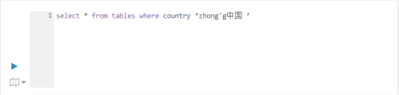
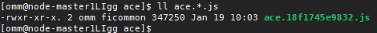
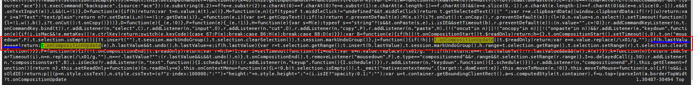
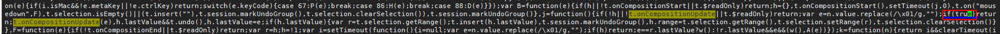

# Hue中的输入框输入中文会出现混乱

## 用户问题

Hue中的输入框输入中文会出现混乱。

## 问题现象

Hue的输入框中输入中文时，会出现混乱，第一次输入不了的情况，也即输入的中文会首先出现英文，中文并未输入，再次输入会带上之前的内容，示例如下：

## 原因分析

Hue对中文的处理存在混乱的情况，需要进行修正。

## 处理步骤

该方案仅适用于MRS 2.x及之前版本集群。

1.  登录MRS Manager页面，选择“服务管理 \> Hue \> 实例”，查询Hue实例所在的节点的IP。
2.  使用**root**用户远程连接工具登录Hue实例所在节点的机器，并执行如下命令切换到omm用户。

    **su - omm**

3.  执行如下的命令，切换到如下的目录。

    **cd /opt/Bigdata/MRS\_Current/1\_\*\_Hue/install/hue/build/static/desktop/js/ace**

4.  执行如下命令找到ace.js的hash文件。

    **ll ace.\*.js**

    示例结果如下：

    

5.  执行如下命令打开并编辑上述的ace.\*.js文件，也即修改hash文件。

    **vim ace.18f1745e9832.js**

6.  在ace.\*.js文件中搜索“t.onCompositionUpdate”关键字。

    

7.  修改上图中红框中，蓝色下划线的内容，也即将蓝色下划线部分 if \(h.lastValue === e\) 修改为 if \(true\) 。

    修改后如下：

    

8.  保存修改。

    hue的所有实例节点均需要执行[1](#li1870412512263)\~[8](#li6167174162911)进行修改。

9.  刷新页面，重新输入中文。

