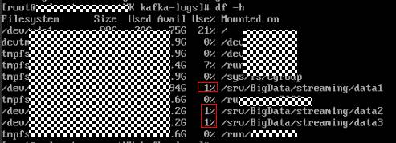
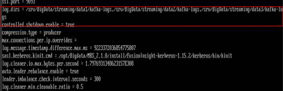
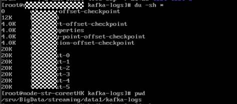
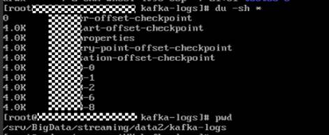
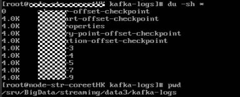
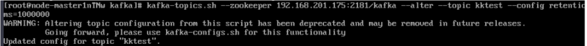
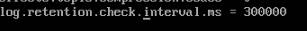

# Kafka集群节点内多磁盘数据量占用高处理办法

## 用户问题

Kafka流式集群节点内有多块磁盘的使用量很高。当达到100%时就会造成kafka不可用如何处理？

## 问题现象

客户购买的MRS Kafka流式集群节点内有多块磁盘，由于分区不合理及业务原因导致某几个磁盘的使用量很高。当达到100%时就会造成kafka不可用。

## 原因分析

需要提前干预处理磁盘数据，全局的log.retention.hours修改需要重启服务。为了不断服，可以将数据量大的单个topic老化时间根据需要改短。

## 处理步骤

1.  登录Kafka集群的l流式Core节点。
2.  执行**df –h**命令查看磁盘使用率。

    

3.  通过kafka配置文件**opt/Bigdata/MRS\_2.1.0/1\_11\_Broker/etc/server.properties**中的配置项**log.dirs**  获得数据存储目录。其中配置文件路径请根据时间环境的集群版本修改，当磁盘有多块时，该配置项有多个，逗号间隔。

    

4.  使用**cd**命令进入使用率较高的磁盘对应的[3](#li1275512545212)中获取的数据存储目录下。
5.  使用**du -sh \***命令打印出当前topic的名称及大小。

    

    

    

6.  由于kafka的全局的数据保留时间默认是7天。部分topic由于业务写入量大，而这些topic的分区正好在上面使用量高的磁盘上，因此导致磁盘使用率较高。
    -   可以通过修改全局数据的保留期为较短时间来释放磁盘空间，该方式需要重启Kafka服务才能生效，可能会影响业务运行。具体请参见[7](#li8609163111334)。
    -   可以单独将topic的数据保留期改为较短时间来释放磁盘空间，该方式无需重启Kafka服务即可生效。具体请参见[8](#li77811261715)。

7.  登录Manager页面，在Kafka的服务配置页面，切换为“全部配置”并搜索“log.retention.hours”配置项，该值默认为7天，请根据需要进行修改。
8.  可以单独将这些磁盘上的topic的数据老化时间修改为较短时间来解决该问题。
    1.  查看topic数据过期时间。

        **bin/kafka-topics.sh --describe --zookeeper  _<ZooKeeper集群业务IP\>_:2181/kafka --topic kktest**

        

    2.  设置topic数据过期时间，其中**--topic**表示具体topic名称，retention.ms=具体的数据过期时间时间，单位是毫秒。

        **kafka-topics.sh --zookeeper  _<ZooKeeper集群业务IP\>_:2181/kafka --alter --topic kktest --config retention.ms=1000000**

        

        设置数据过期时间之后会可能不会立刻执行，删除操作在参数**log.retention.check.interval.ms**所规定时间之后开始执行删，可以通过查看kafka的server.log检索是否有delete字段有判断删除操作是否生效，有delete字段则表示已经  生效，也可以通过执行**df –h**命令查看磁盘的数据量占用情况判断设置是否生效。

        

