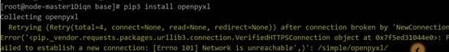

# MRS 集群使用pip3安装python包提示网络不可达

## 用户问题

使用pip3安装python包报错网络不可达。

## 问题现象

执行pip3 install 安装python包报错网络不可达。具体如下图所示：

## 原因分析

客户未给Master节点绑定弹性公网IP，造成报错的发生。

## 处理步骤

1.  登录MRS服务管理控制台。
2.  选择“集群列表 \> 现有集群”，选中当前安装出问题的集群并单击集群名称，进入集群基本信息页面。
3.  在“节点管理”页签单击Master节点组中某一Master节点名称，登录到弹性云服务器管理控制台。
4.  选择“弹性公网IP”页签，单击“绑定弹性公网IP”为弹性云服务器绑定一个弹性公网IP。
5.  登录Master节点执行pip3 install安装python包。

