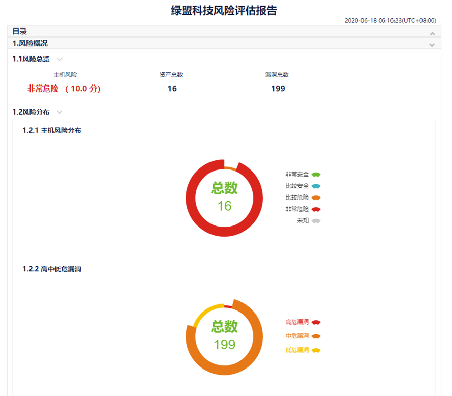
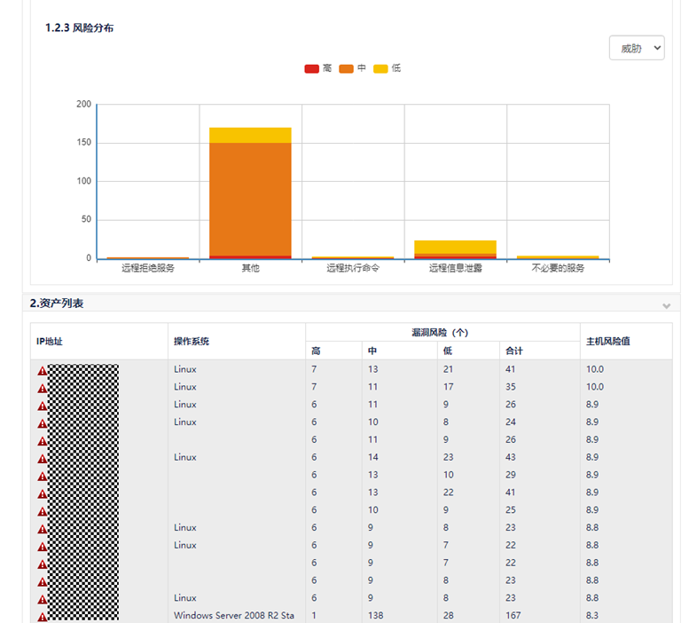
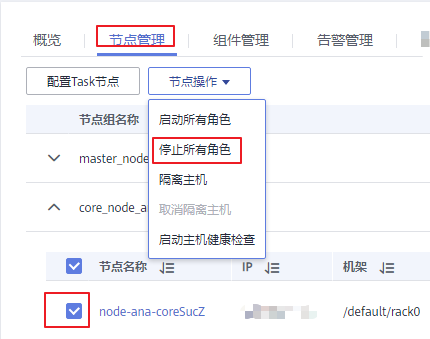

# MRS集群如何进行Euleros系统漏洞升级？

## 用户问题

Euleros系统底层存在漏洞，MRS集群如何进行漏洞升级？

## 问题现象

在使用绿盟软件测试集群，发现有Euleros系统底层存在漏洞，漏洞报告如下：

## 原因分析

在使用绿盟软件测试集群，发现有Euleros系统底层存在漏洞，MRS服务部署在Euleros系统中，因此需要进行漏洞升级。

## 处理步骤

> **说明：** 
>修复漏洞前请确认是否开启了企业主机安全（Host Security Service，简称HSS）服务，如果已开启，需要先暂时关闭HSS服务对MRS集群的监测，漏洞修复完成后重新开启HSS服务。

1.  登录MRS服务控制台。
2.  单击集群名称进入集群详情页面，并选择“节点管理”。
3.  在Core节点组中勾选任意一个Core节点，单击“节点操作 \> 停止所有角色”。

    

4.  通过远登录Core节点后台，参考[如何使用华为云提供的EulerOS镜像源\(x86\_64和ARM\)？](https://support.huaweicloud.com/ecs_faq/ecs_faq_1006.html)配置yum源。
5.  使用**uname –r**或**rpm –qa |grep kernel**命令，查询并记录当前节点内核版本。
6.  执行**yum update –y --skip-broken --setopt=protected\_multilib=false**命令更新补丁。
7.  完成更新后查询内核版本，并执行**rpm -e  _旧内核版本_**  命令删除旧内核版本。
8.  在集群详情页，选择“节点管理”。
9.  在Core节点组中单击已更新补丁的Core名称，进入弹性云服务管理控制台。
10. 在页面右上角单击“重启”，重启Core节点。

    

11. 重启完成后，在集群详情页的“节点管理”的Core节点组中勾选Core节点，单击“节点操作 \> 启动所有角色”。
12. 重复[1](#li1084813184610)\~[11](#li141191257165911)的操作，升级其他Core节点。
13. 所有Core节点升级完成后，参考[1](#li1084813184610)\~[11](#li141191257165911)的操作先升级备Master节点，再升级主Master节点。

