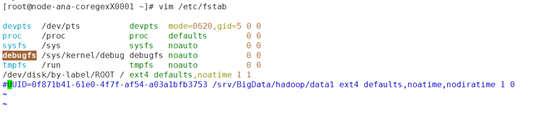
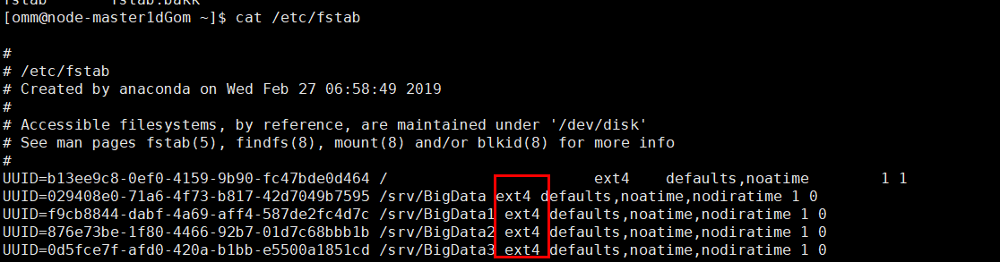

# MRS集群更换磁盘<a name="mrs_03_0213"></a>

## 用户问题<a name="zh-cn_topic_0160818829_section18305143583116"></a>

磁盘无法访问。

## 问题现象<a name="zh-cn_topic_0160818829_section117424454313"></a>

客户创建本地盘系列MRS集群，其中1个Core节点的磁盘存在硬件损坏，导致读取文件失败。

## 原因分析<a name="zh-cn_topic_0160818829_section1237061220324"></a>

磁盘硬件故障。

## 处理步骤<a name="zh-cn_topic_0160818829_section8869162262118"></a>

> **说明：** 
>该指导适用于MRS 3.x之前版本分析集群，如需为流式集群或混合集群更换磁盘，请联系华为云技术支持处理。

1.  登录[MRS Manager](https://support.huaweicloud.com/usermanual-mrs/mrs_01_0102.html)。
2.  选择“主机管理”并单击需要退服主机的“主机名称”，在“角色”列表中单击RegionServer，选择“更多 \> 退服”。
3.  选择“主机管理”并单击需要退服主机的“主机名称”，在“角色”列表中单击DataNode，选择“更多 \> 退服”。
4.  选择“主机管理”并单击需要退服主机的“主机名称”，在“角色”列表中单击NodeManager，选择“更多 \> 退服”。

    > **说明：** 
    >该主机下若还有其他实例，请参考该步骤方式进行退服。

5.  执行**vim /etc/fstab**命令编辑注释旧磁盘的挂载点。

    **图 1**  注释旧磁盘的挂载点<a name="fig19771185515261"></a>  
    

6.  迁移旧磁盘上（例如：/srv/BigData/hadoop/data1/）的用户自有数据。
7.  在集群详情页面，选择“节点管理”。
8.  单击待更换磁盘的“节点名称”进入弹性云服务器管理控制台，单击“关机”。
9.  联系华为云支持人员在后台更换磁盘。
10. 在弹性云服务器管理控制台，单击“开机”，将已更换磁盘的节点开机。
11. 执行**fdisk -l**命令，查看新增磁盘。
12. 使用**cat /etc/fstab**获取盘符。

    **图 2**  获取盘符<a name="fig762411407264"></a>  
    

13. 使用对应的盘符对新磁盘进行格式化。

    例如：**mkfs.ext4 /dev/sdh**

14. 执行如下命令挂载新磁盘。

    **mount** **_新磁盘_** _**挂载点**_

    例如：**mount /dev/sdh /srv/BigData/hadoop/data1**

15. 执行如下命令为新磁盘增加omm用户权限。

    **chown omm:wheel** _**挂载点**_

    例如：**chown -R omm:wheel /srv/BigData/hadoop/data1**

16. 在fstab文件中新增新磁盘UUID信息。
    1.  使用**blkid**命令查看新磁盘的UUID。

        

    2.  打开“/etc/fstab“文件，新增如下信息：

        ```
        UUID=新盘UUID /srv/BigData/hadoop/data1 ext4 defaults,noatime,nodiratime 1 0
        ```

17. 执行如下命令新建日志目录。

    **mkdir -p /srv/BigData/Bigdata**

    **chown omm:ficommon /srv/BigData/Bigdata**

    **chmod 770 /srv/BigData/Bigdata**

18. 登录[MRS Manager](https://support.huaweicloud.com/usermanual-mrs/mrs_01_0102.html)。
19. 选择“主机管理”并单击需要入服主机的“主机名称”，在“角色”列表中单击RegionServer，选择“更多 \> 入服”。
20. 选择“主机管理”并单击需要入服主机的“主机名称”，在“角色”列表中单击DataNode，选择“更多 \> 入服”。
21. 选择“主机管理”并单击需要入服主机的“主机名称”，在“角色”列表中单击NodeManager，选择“更多 \> 入服”。

    > **说明：** 
    >该主机下若还有其他实例，请参考该步骤方式进行入服。

22. 选择“服务管理 \> HDFS”，在“服务状态”页签的“HDFS概述”模块查看“丢失块数”是否为“0”。
    -   “丢失块数”是为“0”，则操作完成。
    -   “丢失块数”不为“0”，请联系华为云支持人员进行处理。


