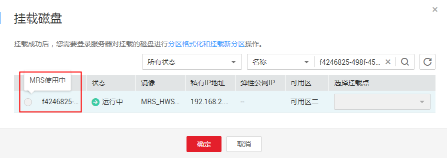
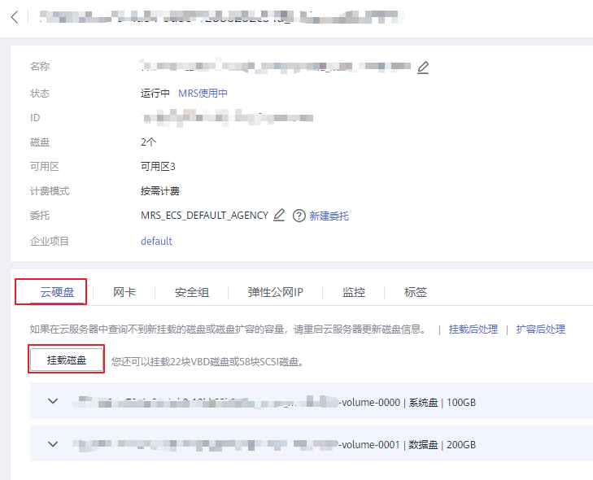
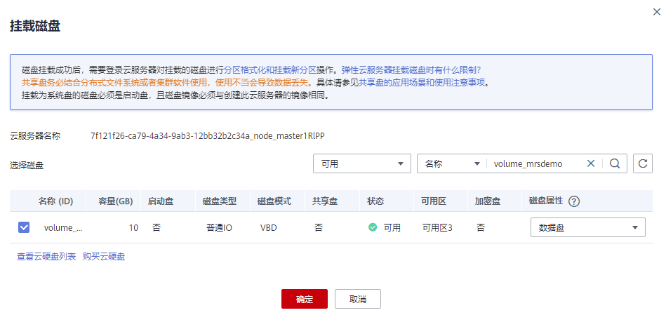

# MRS集群添加新磁盘<a name="ZH-CN_TOPIC_0169495356"></a>

## 用户问题<a name="zh-cn_topic_0160818829_section18305143583116"></a>

MRS HBase服务不可用。

## 问题现象<a name="zh-cn_topic_0160818829_section117424454313"></a>

用户主机的磁盘占用率过高导致服务故障。

## 原因分析<a name="zh-cn_topic_0160818829_section1237061220324"></a>

磁盘容量不足导致无法提供正常服务。

## 处理步骤<a name="zh-cn_topic_0160818829_section8869162262118"></a>

1.  购买云硬盘，具体步骤请参见[购买云硬盘](https://support.huaweicloud.com/qs-evs/zh-cn_topic_0021738346.html)。
2.  挂载云硬盘，具体步骤可参见[挂载非共享云硬盘](https://support.huaweicloud.com/qs-evs/evs_01_0036.html)。
    -   若挂载云硬盘完成，请执行[6](#zh-cn_topic_0160818829_li11355132131419)。
    -   若在云硬盘控制台执行 "挂载" 操作时无法选定云服务器，请执行[3](#zh-cn_topic_0160818829_li1776193652714)。

        **图 1**  无法选定云服务器<a name="zh-cn_topic_0160818829_fig114642046182716"></a>  
        

3.  <a name="zh-cn_topic_0160818829_li1776193652714"></a>登录弹性云服务器控制台，单击待扩容（挂载新磁盘）的弹性云服务器名称。
4.  在“云硬盘“页签，单击“挂载磁盘“。

    **图 2**  到相应节点下挂载云硬盘<a name="zh-cn_topic_0160818829_fig4465194662717"></a>  
    

5.  选择待挂载的新磁盘并单击“确定“完成磁盘挂载。

    **图 3**  挂载磁盘<a name="zh-cn_topic_0160818829_fig194658463270"></a>  
    

6.  <a name="zh-cn_topic_0160818829_li11355132131419"></a>初始化Linux数据盘，具体步骤可参见[初始化Linux数据盘](https://support.huaweicloud.com/qs-evs/evs_01_0033.html)。

    > **说明：**   
    >挂载点目录根据节点DataNode已有的实例编号递增，例如：使用df –h命令查到当前已有的编号为/srv/BigData/hadoop/data1，则新增挂载点为/srv/BigData/hadoop/data2。初始化Linux数据盘新建挂载点时，将新建挂载点命名为/srv/BigData/hadoop/data2，并将新建分区挂载到该挂载点下。例如  
    >```  
    >mkdir /srv/BigData/hadoop/data  
    >mount /dev/xvdb1 /srv/BigData/hadoop/data2  
    >```  

7.  执行以下命令为新磁盘增加omm用户权限。

    **chown omm:wheel  _新增挂载点_**

    例如：**chown omm:wheel /srv/BigData/hadoop/data2**

8.  执行chmod 701命令为新增的挂载点目录添加执行权限。

    **chmod 701  _新增挂载点_**

    例如：**chmod 701 /srv/BigData/hadoop/data2**

9.  登录MRS Manager，扩容DataNode实例和NodeManager实例的数据磁盘。
10. 依次选择 "服务管理 \> HDFS \> 实例 \> 扩容的DataNode节点 \> 实例配置"，"参数类别" 选择 "全部配置"，修改当前节点DataNode实例配置。

    -   在 "搜索" 中输入"dfs.datanode.fsdataset.volume.choosing.policy"，将参数值改为 "org.apache.hadoop.hdfs.server.datanode.fsdataset.AvailableSpaceVolumeChoosingPolicy"。
    -   在 "搜索" 中输入 "dfs.datanode.data.dir"，将参数值改为"/srv/BigData/hadoop/data1/dn,/srv/BigData/hadoop/data2/dn"

    若此两个参数有修改，则单击 "保存配置"，并勾选 "重启角色实例" ，重启DataNode实例。

11. 依次选择 "服务管理 \> Yarn \> 实例 \> 扩容节点的NodeManager \> 实例配置"，"参数类别" 选择 "全部配置"，修改当前节点Yarn NodeManager的实例配置。

    -   在“搜索”中输入 "yarn.nodemanager.local-dirs"，将参数值修改为： "/srv/BigData/hadoop/data1/nm/localdir,/srv/BigData/hadoop/data2/nm/localdir" 。
    -   在“搜索”中输入 "yarn.nodemanager.log-dirs"，将参数值修改为："/srv/BigData/hadoop/data1/nm/containerlogs,/srv/BigData/hadoop/data2/nm/containerlogs"。

    若此两个参数有修改，则单击 "保存配置"，并勾选 "重启角色实例" ，重启NodeManager实例。

12. 查看扩容是否成功，依次选择 "服务管理 \> HDFS \> 实例 \> 扩容的DataNode节点 "，在图表区域，查看实时监控项 "DataNode存储" 中 配置的总磁盘容量是否提升，若图表区域没有监控项 "DataNode存储" ，请单击“定制”增加该监控项。
    -   若配置的总磁盘容量已提升，则扩容完成。
    -   若配置的总磁盘容量未提升，请联系技术支持处理。

13. （可选）扩容Kafka实例的数据盘。

    修改当前节点Kafka实例配置。

    1.  登录MRS Manager，依次选择 "服务管理 \> Kafka \> 实例 \> 扩容的Broker节点 \> 实例配置"，"参数类别" 选择 "全部配置"。
    2.  在 "搜索" 中输入"log.dirs"，加入新增磁盘信息，中间用英文  “,“  分割。

        例如原始只有一块Kafka数据盘，新增一块，则将"/srv/BigData/kafka/data1/kafka-logs" 改为 "/srv/BigData/kafka/data1/kafka-logs,/srv/BigData/kafka/data2/kafka-logs"。

    3.  单击 "保存配置"，并勾选 "重启角色实例" 后根据提示重启实例。
    4.  查看扩容是否成功，依次选择 "服务管理 \> Kafka \> 实例 \> 扩容的Broker节点 "，查看实时监控项 "Broker磁盘容量大小" 中配置的总磁盘容量是否提升。


## 建议与总结<a name="zh-cn_topic_0160818829_section8898183420"></a>

-   当磁盘的使用率超过85%时，建议用户进行磁盘扩容，并将新购买的磁盘挂载到弹性云服务器上与集群进行关联。
-   具体挂载步骤、配置参数请根据实际情况进行。

