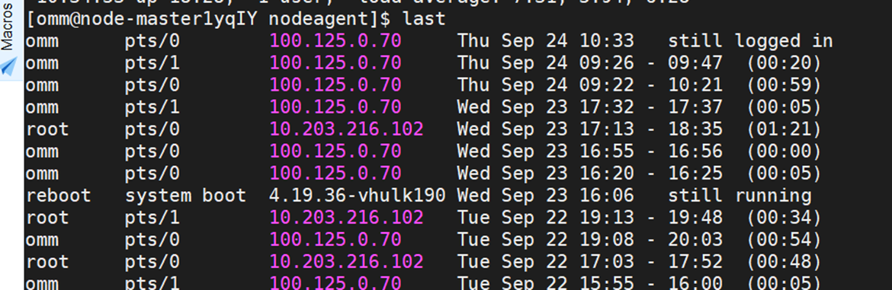
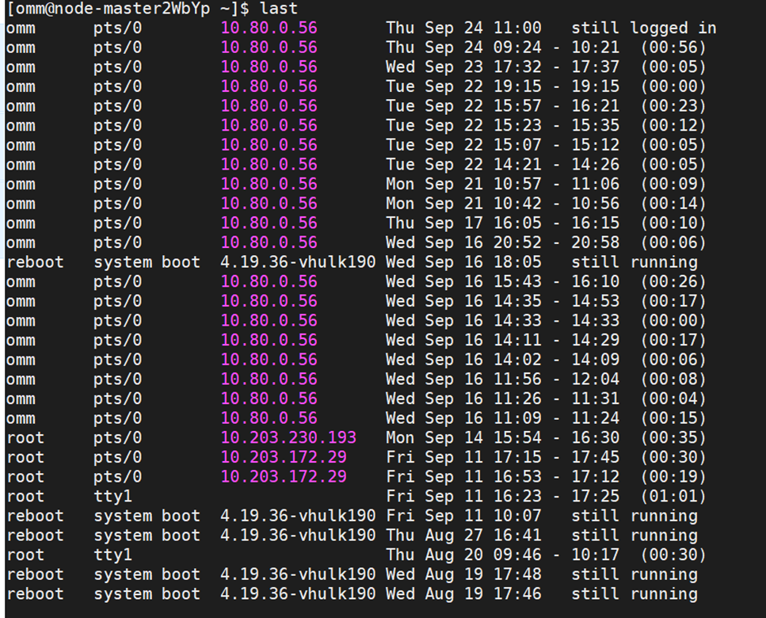
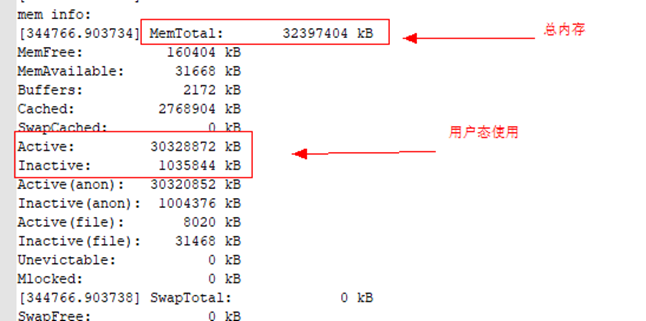
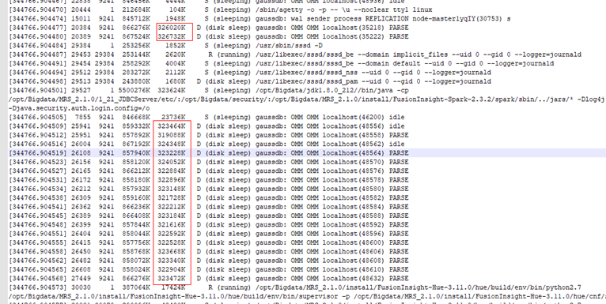
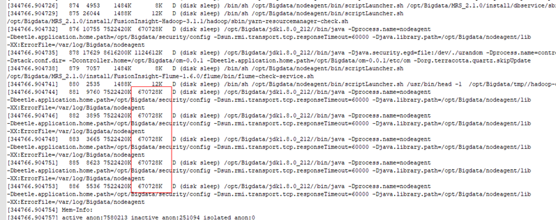

# MRS集群频繁产生告警

## 用户问题

集群频繁发出Manager主备节点间心跳中断，DBService主备节点间心跳中断，节点故障等告警，偶尔会造成hive不可用。

## 问题现象

集群频繁发出Manager主备节点间心跳中断，DBService主备节点间心跳中断，节点故障等告警，偶尔会造成hive不可用，影响客户业务。

## 原因分析

1.  在出现告警时间点发现虚拟机发生了重启，告警发生的原因是因虚拟机重启导致的。

    

    

2.  经OS定位虚拟机发生重启的原因是节点没有可用的内存，系统发生内存溢出触发了oom-killer，当进程处于被调用的状态会使进程处于disk sleep状态，最终导致虚拟机发生重启。

    

    

    

3.  查看占用的内存进程，发现占用内存都是正常的业务进程。

结论：虚拟机内存不能满足服务需求。

## 处理步骤

-   建议扩大节点内存。
-   建议关闭不需要的服务来规避该问题。

