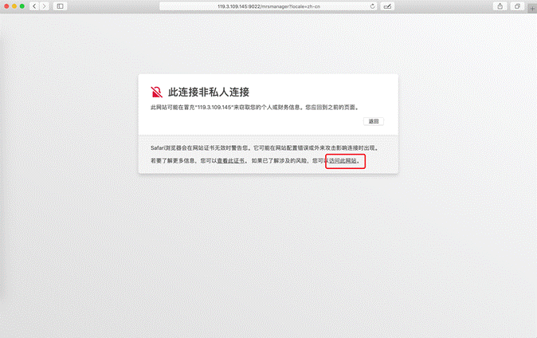
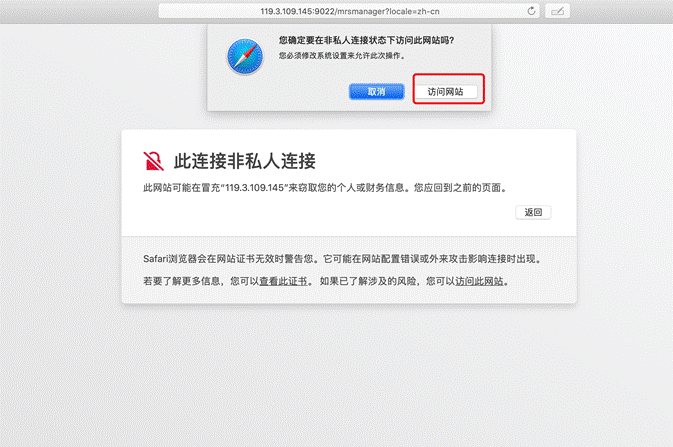
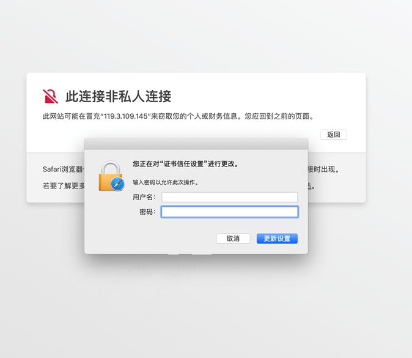
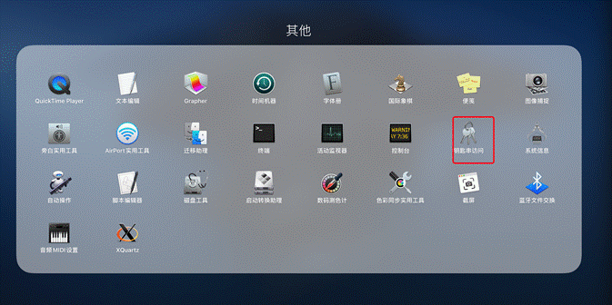
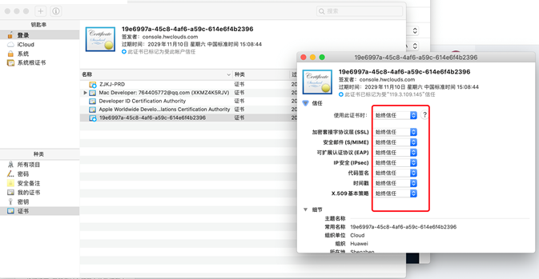

# Mac如何访问MRS Manager

## 用户问题

在Mac电脑上如何使用谷歌浏览器访问MRS Manager？

## 问题现象

在Mac电脑上无法使用谷歌浏览器访问MRS Manager。

## 原因分析

由于Mac电脑的证书限制导致无法访问。

## 处理步骤

1.  复制MRS Manager的登录链接，使用Safari浏览器访问。
2.  在提示的“此链接非私人链接”单击“显示详细信息 \> 访问此网站"。

    **图 1**  Safari访问MRS Manager  
    

3.  在弹出的确认页面，选择“访问网站”。

    **图 2**  访问确认页面  
    

4.  输入自己电脑的用户名和密码以允许访问MRS Manager。

    **图 3**  输入用户名密码  
    

5.  显示MRS Manager登录页面，此时谷歌浏览器暂时还不能登录MRS Manager页面，请继续操作后续步骤。
6.  在Mac应用中选择钥匙串访问。

    **图 4**  钥匙串访问  
    

7.  “钥匙串”选择“登录”，“种类”选择“证书”。
8.  找到签发者为“console.hwclouds.com”的证书，双击证书并展开“信任”。
9.  将“使用此证书时” 设置为“始终信任”并关闭弹窗。

    **图 5**  信任证书  
    

10. 在出现的确认框中输入登录密码，此时在Chrome中即可访问MRS Manager。

