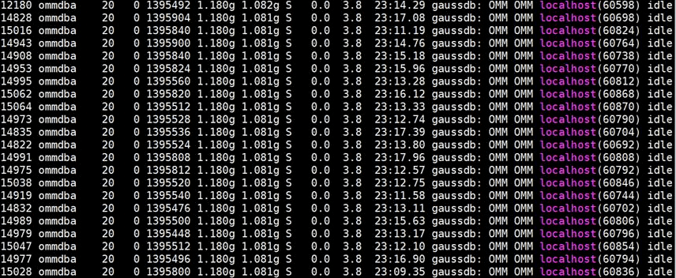

# PMS进程占用内存高问题处理

## 用户问题

主Master节点内存使用率高如何处理？

## 问题现象

主Master节点内存使用率高，且用**top -c**命令查询得内存占用量高的是如下idle的进程。

## 原因分析

-   PostgreSQL缓存：除了常见的执行计划缓存、数据缓存，PostgreSQL为了提高生成执行计划的效率，还提供了catalog，relation等缓存机制。长连接场景下这些缓存中的某些缓存是不会主动释放的，因此可能导致长连接占用大量的内存不释放。
-   PMS是MRS的监控进程，此进程会经常创建表分区或者新表，由于PostgreSQL会缓存当前会话访问过的对象的元数据，且PMS的数据库连接池连接会长时间存在，所以连接占用的内存会逐渐上升。

## 处理步骤

1.  以**root**用户登录主Master节点。
2.  执行如下命令查询PMS进程号。

    **ps -ef | grep =pmsd |grep -v grep**

3.  执行如下命令关闭PMS进程，其中**PID**为[2](#li12558203321311)中获取的PMS进程号。

    **kill -9 PID**

4.  等待PMS进程自动启动。

    PMS启动需要2-3分钟。PMS是监控进程，重启不影响大数据业务。

