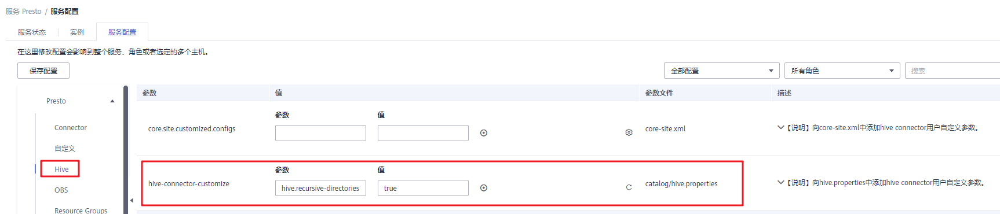

# Presto查询Hive表无数据

## 用户问题

使用presto查询Hive表无数据。

## 问题现象

通过Tez引擎执行union相关语句写入的数据，Presto无法查询。

## 原因分析

由于Hive使用Tez引擎在执行union语句时，生成的输出文件会保存在HIVE\_UNION\_SUBDIR目录中，而Presto默认不读取子目录下的文件，所以没有读取到HIVE\_UNION\_SUBDIR目录下的数据。

## 处理步骤

1.  在集群详情页面选择“组件管理 \> Presto \> 服务配置”。
2.  切换“基础配置”为全部配置“。
3.  在左侧导航处选择“Presto \> Hive”，在catalog/hive.properties文件中增加hive.recursive-directories参数，值为true。

    

4.  单击“保存配置”并勾选“重新启动受影响的服务或实例。”。

