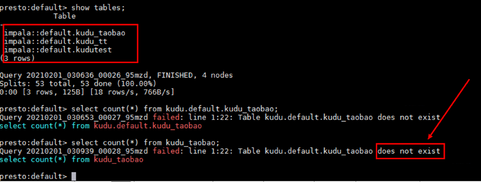
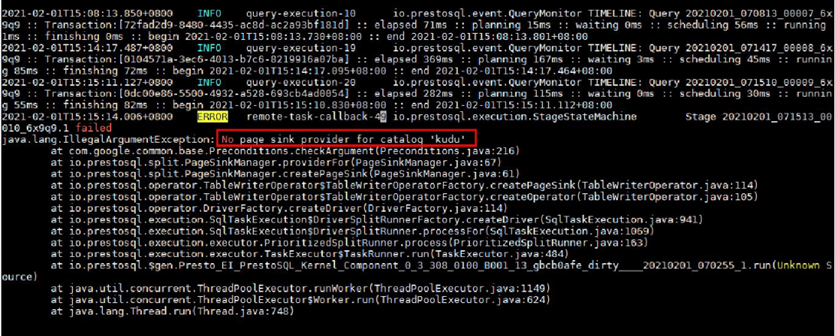

# Presto查询Kudu表报错<a name="mrs_03_0278"></a>

## 用户问题<a name="section18305143583116"></a>

使用presto查询Kudu表报错。

## 问题现象<a name="section117424454313"></a>

使用presto查询Kudu表，报表找不到的错误：



后台报错：



## 原因分析<a name="section1237061220324"></a>

在实际的运行节点（worker实例所在节点）没有kudu相关配置。

## 处理步骤<a name="section520813413313"></a>

1.  在集群presto所有的worker实例节点添加配置文件kudu.properties。

    配置文件保存路径：/opt/Bigdata/MRS\_2.x/1\_x\_Worker/etc/catalog/ \(请根据集群实际版本修改路径\)

    配置文件内容：

    ```
    connector.name=kudu
    kudu.client.master-addresses=KuduMasterIP1:port,KuduMasterIP2:port,KuduMasterIP3:port  
    ```

    > **说明：** 
    >-   KuduMaster节点IP和端口请根据实际情况填写。
    >-   为配置文件添加和文件保存路径下其他文件一致的文件权限、属组。

2.  修改完成之后，请在集群详情页面选择“组件管理 \> Kudu”，单击“更多 \> 重启服务”。

