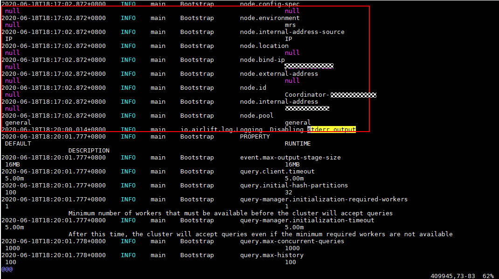
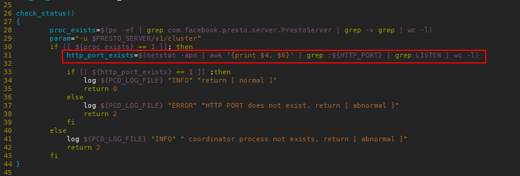

# Presto的coordinator无法正常启动

## 用户问题

Presto的coordinator未知原因被kill，或者presto的coordinator进程无法正常启动。

## 问题现象

Presto的coordinator无法正常启动，Manager页面上显示presto coordinator进程正常启动且状态正常，但查看后台日志coordinator进程未真正启动，只有如下日志：

presto的coordinator未真正启动即被Kill了，不再打印其他日志，查看presto的其他日志也未发现为何被kill。

## 原因分析

presto的健康检查脚本的端口检查逻辑中未做好端口的区分。

## 处理步骤

1.  使用工具分别登录集群的Master节点执行如下操作。
2.  执行如下命令编辑文件。

    **vim /opt/Bigdata/MRS\_1.9.2/install/FusionInsight-Presto-0.216/ha/module/harm/plugin/script/pcd.sh**

    该文件中的第31行修改为“http\_port\_exists=$\(netstat -apn | awk '\{print $4, $6\}' | grep :$\{HTTP\_PORT\} | grep LISTEN | wc -l\)“。

    

3.  保存如上修改，再在manager页面上选择“服务管理 \> Presto \> 实例”，重启Coordinator进程。

