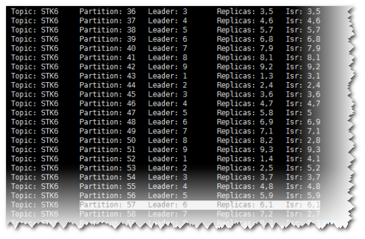
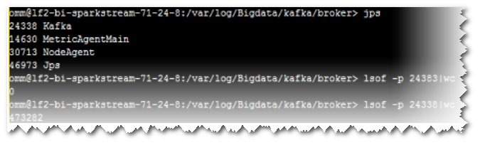

# Producer偶现发送数据失败，日志提示Too many open files in system

## 问题背景与现象

在使用Producer向Kafka发送数据功能时，发现客户端发送失败。

**图 1**  Producer发送数据失败  

## 可能原因

1.  Kafka服务异常。
2.  网络异常。
3.  Kafka Topic异常。

## 原因分析

1.  查看kafka服务状态：

    -   MRS Manager界面操作：登录MRS Manager，依次选择 "服务管理 \> Kafka ，查看当前Kafka状态，发现状态为良好，且监控指标内容显示正确。
    -   FusionInsight Manager界面操作：登录FusionInsight Manager，选择“集群 \>  _待操作集群的名称_  \> 服务 \> Kafka，

        查看当前Kafka状态，发现状态为良好，且监控指标内容显示正确。

2.  查看SparkStreaming日志中提示错误的Topic信息。

    执行Kafka相关命令，获取Topic分布信息和副本同步信息，观察返回结果。

    **kafka-topics.sh** **--describe** **--zookeeper <zk\_host:port/chroot\>**

    如[图2](#zh-cn_topic_0167276060_fig1986936155415)所示，发现对应Topic状态正常。所有Partition均存在正常Leader信息。

    **图 2**  Topic状态  
    

3.  通过telnet命令，查看是否可以连接Kafka。

    **telnet** **kafka业务ip** **kafka业务port**

    如果无法telnet成功，请检查网络安全组与ACL。

4.  通过SSH登录Kafka Broker。

    通过**cd /var/log/Bigdata/kafka/broker**命令进入日志目录。

    查看server.log发现如下日志抛出java.io.IOException: Too many open files in system。

    **图 3**  日志异常  
    

5.  通过lsof命令查看当前节点Kafka进程句柄使用情况，发现占用的句柄数达到了47万。

    **图 4**  句柄数  
    

6.  排查业务代码，不停地new新的producer对象，未正常关闭。

## 解决办法

1.  停止当前应用，保证服务端句柄不再疯狂增加影响服务正常运行。
2.  优化应用代码，解决句柄泄露问题。

    建议：全局尽量使用一个Producer对象，在使用完成之后主动调用close接口进行句柄关闭。

