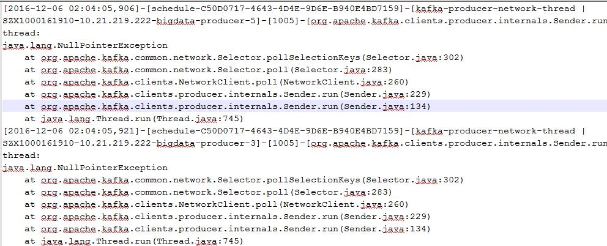
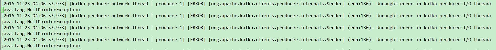
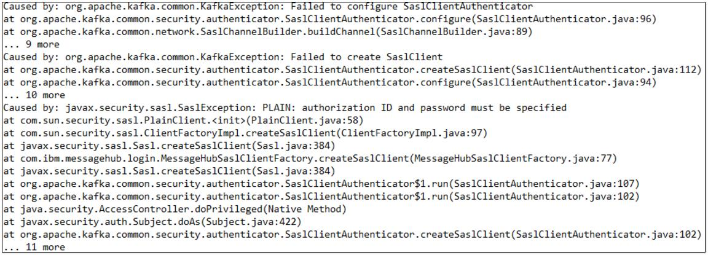
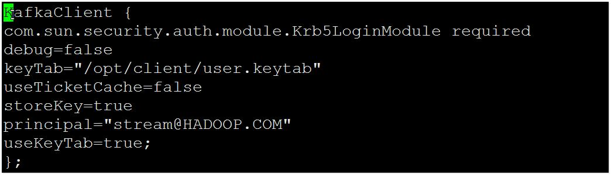
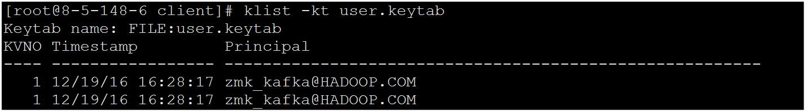

# Producer发送数据失败，抛出NullPointerException

## 问题现象

使用MRS安装集群，主要安装ZooKeeper、Kafka。

在使用Producer向Kafka发送数据功能时，发现客户端抛出NullPointerException。

## 可能原因

1.  Kafka服务异常。
2.  客户端Producer侧配置jaas和keytab文件错误

## 原因分析

Producer发送数据到Kafka失败，可能原因客户端Producer侧问题或者Kafka侧问题。

1.  通过MRS Manager页面，点击“Services \> Kafka”，查看当前Kafka集群当前状态，发现状态为Good，且监控指标内容显示正确。

    **图 1**  Kafka的服务状态  
    

2.  查看Producer客户端日志，发现打印NullPointerException异常信息，如[图2](#zh-cn_topic_0167274517_fig6969134112441)所示。

    **图 2**  Producer客户端日志  
    

    或者日志中只有异常信息没有堆栈信息（只有NullPointerException无堆栈信息，出现这个问题是jdk的自我保护，相同堆栈打印太多，就会触发这个保护开关，后续不再打印堆栈），如[图3](#zh-cn_topic_0167274517_fig159845167450)所示。

    **图 3**  异常信息  
    

1.  查看Producer客户端日志，发现打印Failed to configure SaslClientAuthenticator异常信息，如[图4](#zh-cn_topic_0167274517_fig4619788467)所示。

    **图 4**  异常日志信息  
    

1.  认证失败导致创建KafkaChannel失败，导致通过channel\(key\)方法获取的KafkaChannel为空，以至于疯狂打印NullPointerException，上述日志可以发现，认证失败的原因是用户密码为空（用户名不太可能为空），密码为空的原因可能是用户名不匹配导致。
2.  检查Jaas文件和Keytab文件，发现Jaas文件中配置使用的pricipal为stream。

    **图 5**  检查Jaas文件  
    

    查看user.keytab文件，发现principal为zmk\_kafka。

    **图 6**  查看user.keytab文件  
    

    发现jaas文件和user.keytab文件中principal不对应。

## 解决办法

1.  应用程序自动定时更新jaas文件，但是有两个不同的进程在进行更新，一个进程写入正确的principal而另一个却写入了错误的principal，以至于程序时而正常，时而异常。
2.  修改jaas文件，确保使用的principal在Keytab文件中存在。

