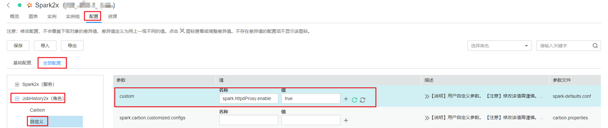
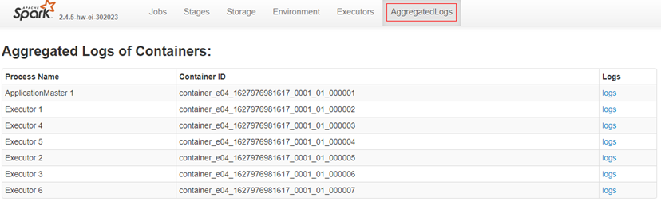
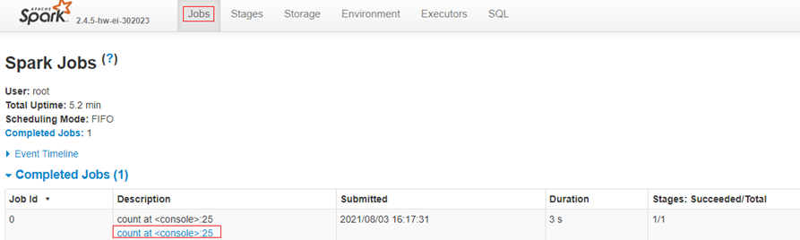
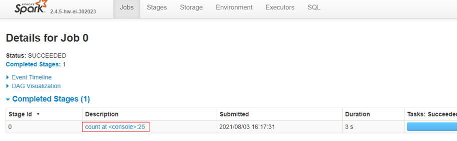
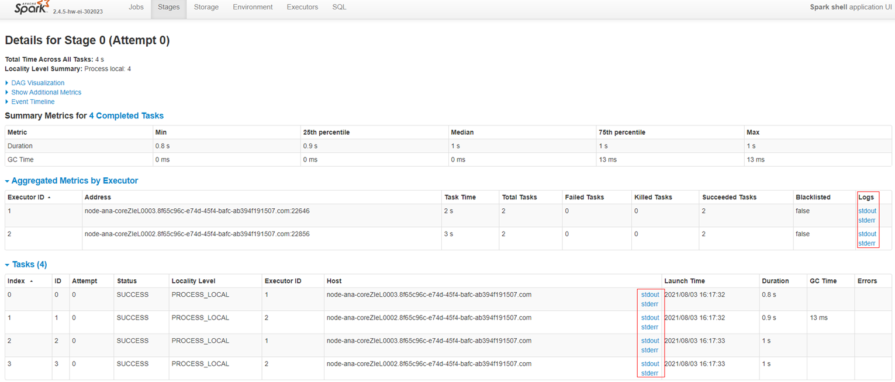
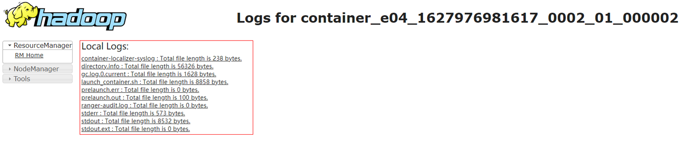

# Spark2x原生页面上stderr和stdout无法跳转到日志页面

## 用户问题

使用MRS 3.x版本集群，运行Spark任务，在Spark2x原生页面上无法直接点击stderr和stdout跳转到日志页面

## 问题现象

使用MRS 3.x版本集群，运行Spark任务，在Spark2x原生页面上无法直接点击stderr和stdout跳转到日志页面。

## 原因分析

配置项spark.httpdProxy.enable未开启。

## 修改配置项查看日志处理步骤

1.  在客户端修改spark-defaults.conf的配置项：spark.httpdProxy.enable = true，该配置项取值默认为false。
2.  登录Manager界面，选择“集群 \> 服务 \> Spark2x \> 配置 \> 全部配置 \> JobHistory2x \> 自定义 \> custom”，增加自定义配置项：spark.httpdProxy.enable=true。

    **图 1**  自定义配置项  
    

3.  参考上一步，分别选择“集群 \> 服务 \> Spark2x \> 配置 \> 全部配置 \> JDBCServer2x \> 自定义 \> custom”和“集群 \> 服务 \> Spark2x \> 配置 \> 全部配置 \> SparkResource2x \> 自定义 \> custom”添加自定义配置：spark.httpdProxy.enable=true。
4.  单击“保存”保存配置，并在“集群 \> 服务 \> Spark2x \> 概览”页签右上角，选择“更多\> 滚动重启服务”。

    **图 2**  滚动重启Spark2x  
    

5.  登录Spark2x原生页面即可单击stdout或者stderr访问到executor日志页面。

## 不修改配置项查看日志处理步骤

-   查看运行完成任务日志

    在Spark2x原生页面最上方有一个按钮，可以查看汇聚后任务日志：**AggregatedLogs**

    **图 3**  AggregatedLogs  
    

-   查看运行中的任务日志

    在Spark2x原生页面，通过“Jobs \> Stage \> Task”找到对应的executor，单击后面的stdout或者stderr查看整个executor日志。

    **图 4**  Jobs  
    

    **图 5**  Stage  
    

    **图 6**  Task  
    

## 参考信息

通过单击stdout或者stderr进入日志页面以后只会展示stdout或者stderr的日志，如果需要查看完整日志，可以通过将url里面的stdout或者stderr去掉，然后就可以直接访问这个executor的所有日志。

例如：https://<EIP\>:9022/component/Yarn/NodeManager/15/node/containerlogs/container\_e04\_1627976981617\_0002\_01\_000002/root/**stderr**?start=-4096

修改为：

https://<EIP\>:9022/component/Yarn/NodeManager/15/node/containerlogs/container\_e04\_1627976981617\_0002\_01\_000002/root/?start=-4096

即可看到所有日志文件。

**图 7**  所有日志文件  

