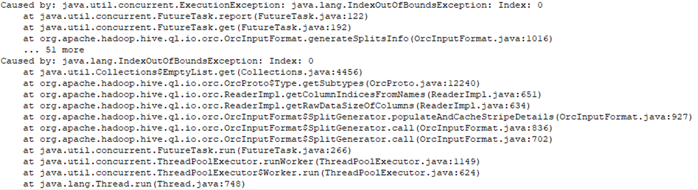

# SparkSQL读取orc表报错<a name="mrs_03_0296"></a>

## 用户问题<a name="section18305143583116"></a>

Hive创建orc存储格式的表，用SparkSQL读取该表报错。

## 问题现象<a name="section117424454313"></a>

Hive创建orc存储格式的表，用SparkSQL读取该表报错：



## 原因分析<a name="section1237061220324"></a>

该问题为一个开源bug：[https://issues.apache.org/jira/browse/HIVE-11102](https://issues.apache.org/jira/browse/HIVE-11102)，使用开源的hive 1.2.1版本包就有可能触发此问题

MRS的hive for spark相关代码已经合入修改该bug。

## 处理步骤<a name="section6794101255512"></a>

使用集群自带的hive for spark包：

```
hive-beeline-1.2.1.spark_2.2.1-mrs-x.x.x.jar
hive-cli-1.2.1.spark_2.2.1-mrs-x.x.x.jar
hive-common-1.2.1.spark_2.2.1-mrs-x.x.x.jar
hive-exec-1.2.1.spark_2.2.1-mrs-x.x.x.jar
hive-jdbc-1.2.1.spark_2.2.1-mrs-x.x.x.jar
hive-metastore-1.2.1.spark_2.2.1-mrs-x.x.x.jar
```

华为云Maven库请参考指导[通过开源镜像站获取样例工程](https://support.huaweicloud.com/devg3-mrs/mrs_07_010002.html)。

