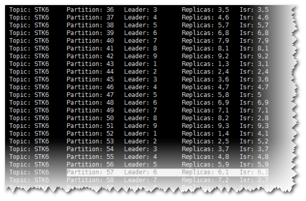

# SparkStreaming消费Kafka消息失败，提示Couldn't find leader offsets<a name="ZH-CN_TOPIC_0183415854"></a>

## 问题背景与现象<a name="zh-cn_topic_0167274891_s8c5a413588744f3ea1320d012fdb73cb"></a>

使用SparkStreaming来消费Kafka中指定Topic的消息时，发现无法从Kafka中获取到数据。提示如下错误： Couldn't find leader offsets。


## 可能原因<a name="zh-cn_topic_0167274891_s32d34cd2ed084d9dbf63d1ca6576eea0"></a>

-   Kafka服务异常。
-   网络异常。
-   Kafka Topic异常。

## 原因分析<a name="zh-cn_topic_0167274891_section7028627115832"></a>

1.  通过MRS Manager页面，单击“服务管理 \> Kafka”，查看当前Kafka集群当前状态，发现状态为良好，且监控指标内容显示正确。

    

2.  查看SparkStreaming日志中提示错误的Topic信息。

    执行Kafka相关命令，获取Topic分布信息和副本同步信息，观察返回结果。

    **kafka-topics.sh --describe --zookeeper <zk\_host:port/chroot\> --topic <topic name\>**

    如下所示，发现对应Topic状态正常。所有Partition均存在正常Leader信息。

    **图 1**  Topic分布信息和副本同步信息<a name="zh-cn_topic_0167274891_fig107170333110"></a>  
    

3.  检查客户端与Kafka集群网络是否连通，若网络不通协调网络组进行处理。
4.  通过SSH登录Kafka Broker。

    通过**cd /var/log/Bigdata/kafka/broker**命令进入日志目录。

    查看server.log发现如下日志抛出java.lang.OutOfMemoryError: Direct buffer memory。

    ```
    2018-05-30 12:02:00,246 | ERROR | [kafka-network-thread-6-PLAINTEXT-3] | Processor got uncaught exception. | kafka.network.Processor (Logging.scala:103) 
    
     java.lang.OutOfMemoryError: Direct buffer memory
     at java.nio.Bits.reserveMemory(Bits.java:694)
     at java.nio.DirectByteBuffer.<init>(DirectByteBuffer.java:123)
     at java.nio.ByteBuffer.allocateDirect(ByteBuffer.java:311)
     at sun.nio.ch.Util.getTemporaryDirectBuffer(Util.java:241)
     at sun.nio.ch.IOUtil.read(IOUtil.java:195)
     at sun.nio.ch.SocketChannelImpl.read(SocketChannelImpl.java:380)
    ```

    at org.apache.kafka.common.network.PlaintextTransportLayer.read\(PlaintextTransportLayer.java:110\)

5.  通过MRS Manager页面，单击“服务管理\> Kafka \> 服务配置”，查看当前Kafka集群配置，发现“KAFKA\_JVM\_PERFORMANCE\_OPTS“的中“-XX:MaxDirectMemorySize“值为“1G“。
6.  直接内存配置过小导致报错，而且一旦直接内存溢出，该节点将无法处理新请求，会导致其他节点或者客户端访问超时失败。

## 解决办法<a name="zh-cn_topic_0167274891_section54081112311"></a>

1.  登录到MRS Manager，选择“服务管理 \> Kafka \> 服务配置”。
2.  “参数类别“选择“全部配置“，搜索并修改KAFKA\_JVM\_PERFORMANCE\_OPTS的值。
3.  单击“保存配置”，勾选“重新启动受影响的服务或实例。”并单击“确定”重启服务。

