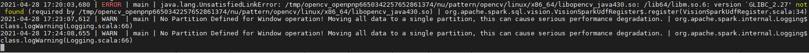
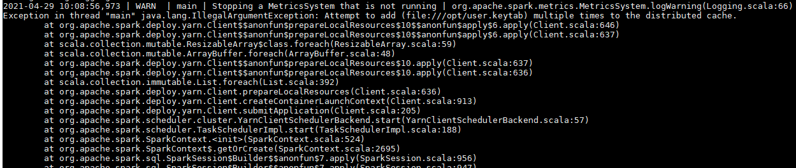

# Spark任务提交失败

## 问题现象

-   Spark提交任务直接提示无法提交任务。
-   Spark提示无法获取到yarn的相关jar包。
-   提示多次提交一个文件。

## 原因分析

-   问题1：

    最常见的无法提交任务原因是认证失败，

    

    还有可能是参数设置不正确。

-   问题2：

    集群默认会把分析节点的hadoop相关jar包添加到任务的classpath中，如果提示yarn的包找不到，一般都是因为hadoop的相关配置没有设置。

-   问题3：

    常见的场景是使用--files上传了user.keytab，然后使用--keytab又指定了同一个文件，导致一个文件多次被上传。

    

## 处理步骤

-   问题1：

    重新kinit一个用户并修改相应的配置参数。

-   问题2：

    查看hadoop相关的配置项是否正确，查看spark的conf目录下的core-site.xml，hdfs-site.xml，yarn-site.xml，mapred-site.xml等配置文件是否存在问题。

-   问题3：

    重新复制一个user.keytab，例如：

    **cp user.keytab user2.keytab**

    **spark-submit --master yarn --files user.keytab --keytab user2.keytab ......**

