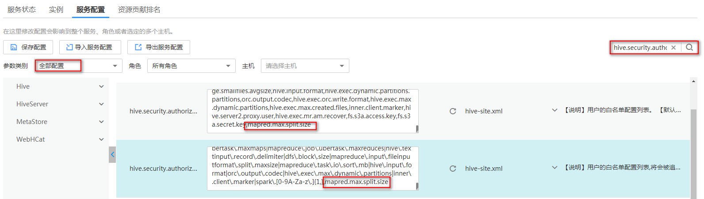

# Spark应用下修改split值时报错

## 用户问题

在Spark应用下修改split值时报错。

## 问题现象

客户需要通过修改一个split最大值来实现多个mapper ，从而达到提速的目的,   但是目前执行**set $参数**命令修改Hive值时报错。

## 原因分析

-   在安全模式下配置白名单启停参数**hive.security.whitelist.switch**时，需要运行的参数必须在**hive.security.authorization.sqlstd.confwhitelist**  中配置。

    

-   默认白名单中没有包含**mapred.max.split.size**参数，所以运行的时候会提示不允许。

## 处理步骤

1.  登录到MRS Manager，选择“服务管理“-\>“Hive“-\>“服务配置“。
2.  “参数类别“选择“全部配置“，搜索**hive.security.authorization.sqlstd.confwhitelist**，把**mapred.max.split.size**加进**hive.security.authorization.sqlstd.confwhitelist**，详细信息可参考[从零开始使用Hive](https://support.huaweicloud.com/zh-cn/usermanual-mrs/mrs_01_0442.html)。

    

3.  修改完成后，重启Hive组件。
4.  执行**set mapred.max.split.size=1000000**，系统不在报错，则表示修改成功。

