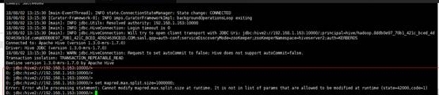
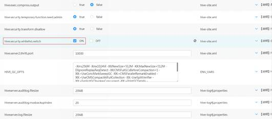

# Spark应用下修改split值时报错

## 用户问题

在Spark应用下修改split值时报错。

## 问题现象

客户需要通过修改一个split最大值来实现多个mapper ，从而达到提速的目的,   但是目前执行**set $参数**命令修改Hive值时报错。

## 原因分析

-   在安全模式下配置白名单启停参数**hive.security.whitelist.switch**时，需要运行的参数必须在**hive.security.authorization.sqlstd.confwhitelist**  中配置。

    

-   默认白名单中没有包含**mapred.max.split.size**参数，所以运行的时候会提示不允许。

## 处理步骤

1.  进入Hive服务配置页面：
    -   MRS 1.8.10及之前版本，登录MRS Manager页面，具体请参见[访问MRS Manager](https://support.huaweicloud.com/usermanual-mrs/mrs_01_0102.html)，然后选择“服务管理 \> Hive \> 服务配置”，单击“基础配置”下拉菜单，选择“全部配置”。
    -   MRS 1.8.10之后及2._x_版本，单击集群名称，登录集群详情页面，选择“组件管理 \> Hive \> 服务配置”，单击“基础配置”下拉菜单，选择“全部配置”。

        > **说明：** 
        >若集群详情页面没有“组件管理”页签，请先完成IAM用户同步（在集群详情页的“概览”页签，单击“IAM用户同步“右侧的“单击同步”进行IAM用户同步）。

    -   MRS 3.x及后续版本，登录FusionInsight Manager，然后选择“集群 \>  _待操作的集群名_称 \> 服务 \> Hive \> 配置 \> 全部配置”。

2.  搜索**hive.security.authorization.sqlstd.confwhitelist.append**，把**mapred.max.split.size**加进**hive.security.authorization.sqlstd.confwhitelist.append**中，详细信息可参考[从零开始使用Hive](https://support.huaweicloud.com/zh-cn/cmpntguide-mrs/mrs_01_0442.html)。
3.  修改完成后，保存配置，重启Hive组件。
4.  执行**set mapred.max.split.size=1000000**，系统不再报错，则表示修改成功。

