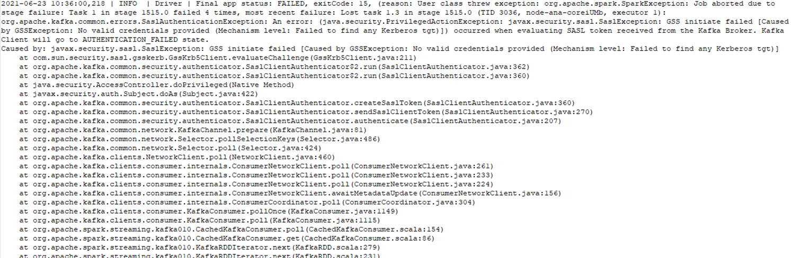

# Spark连接Kafka认证错误

## 用户问题

Spark消费kafka数据，过一天以后就会出现认证失败的报错。

## 问题现象

MRS 2.1.0版本集群中Spark消费kafka数据，过一天以后就会出现认证失败的报错：

## 原因分析

集群版本和运行的程序包版本不匹配。

## 处理步骤

1.  参考[运行Spark Streaming 对接Kafka0-10样例程序](https://support.huaweicloud.com/devg-mrs/mrs_06_0213.html#section9)进行相关配置。
2.  当前集群为MRS 2.1.0版本，请如需使用maven库中的提供的样例程序，请获取spark-streaming-kafka-0-10\_2.11-2.3.2-mrs-2.1.jar包。

