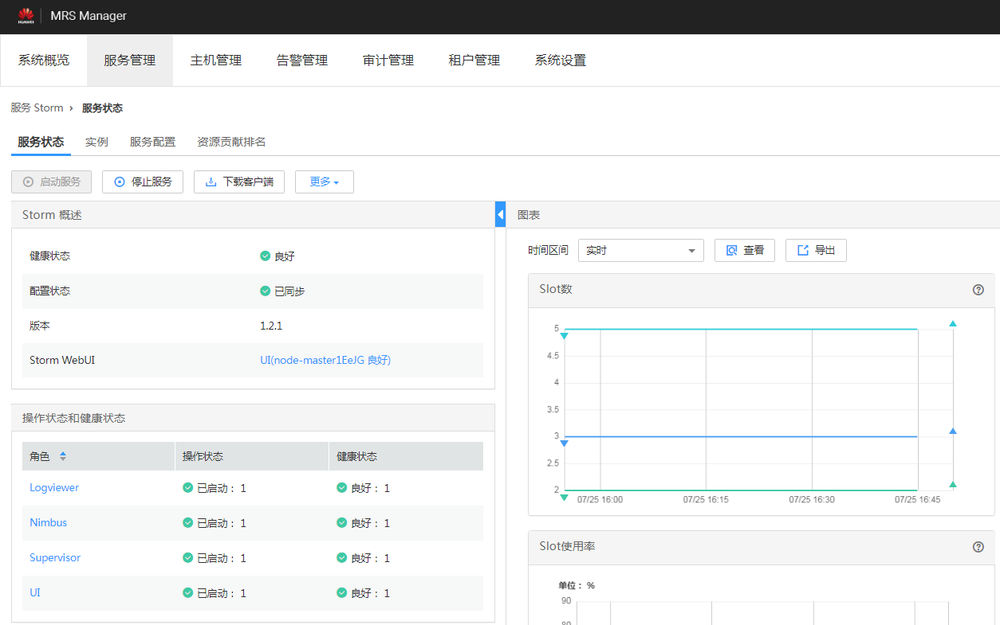
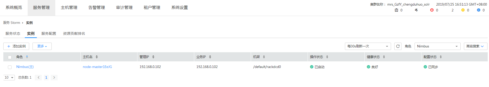

# UI查看信息显示Internal Server Error<a name="ZH-CN_TOPIC_0183502591"></a>

## 问题背景与现象<a name="zh-cn_topic_0167275896_s8c5a413588744f3ea1320d012fdb73cb"></a>

使用MRS版本安装集群，主要安装ZooKeeper、Strom。

通过MRS Manager中的Storm Status页面UI连接访问信息时出现Internal Server Error。

UI页面出现如下信息：

```
Internal Server Error
org.apache.thrift7.transport.TTransportException: Frame size (306030) larger than max length (1048576)!
```

## 可能原因<a name="zh-cn_topic_0167275896_s32d34cd2ed084d9dbf63d1ca6576eea0"></a>

-   Storm服务中Nimbus异常。
-   Storm集群信息较多超过系统默认Thrift传输大小的设置。

## 原因分析<a name="zh-cn_topic_0167275896_section6293945184927"></a>

1.  在MRS Manager页面，选择“服务管理 \> Storm”，查看当前Storm服务状态，发现状态为“良好“，且监控指标内容显示正确。

    **图 1**  Storm服务状态<a name="zh-cn_topic_0167275896_fig16826024112611"></a>  
    

2.  选择“实例”页签，查看Nimbus实例状态，显示正常。

    **图 2**  Nimbus实例状态<a name="zh-cn_topic_0167275896_fig63906171271"></a>  
    


1.  选择“服务配置”页签，查看当前Storm集群thrift相关配置，发现nimbus.thrift.max\_buffer\_size参数配置为1048576（1M）。
2.  上述配置和异常信息中信息一致，说明当前配置的Thrift的buffer size小于集群信息所需的buffer size。

## 解决方法<a name="zh-cn_topic_0167275896_section15639239143944"></a>

调整Storm集群中Thrift的Buffer Size大小，具体大小根据错误信息进行实际调整。

1.  在MRS Manager页面，选择“服务管理 \> Storm \> 服务配置”，“参数类别“选择“全部配置“。
2.  修改nimbus.thrift.max\_buffer\_size参数为10485760（10M）。
3.  单击“保存配置”，勾选“重新启动受影响的服务或实例。”并单击“确定”重启服务。

